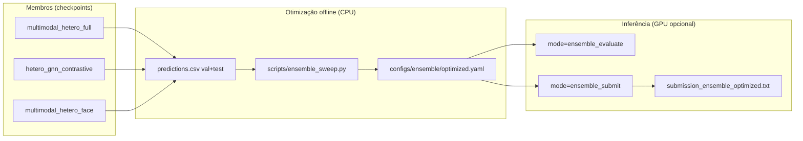

# Structural Map — BAH AH-Challenge

> Mapa de componentes do pipeline neural e pontos de consolidação.

---

## Modelos Lightning (competição)

| Modelo | Preset Hydra | Checkpoint (run atual) | Papel no ensemble |
|--------|--------------|--------------------------|-------------------|
| `multimodal_hetero_full` | `+experiment=multimodal_hetero_full` | `outputs/multimodal_hetero_full/20260706_213403` | membro principal (41.7%) |
| `hetero_gnn_contrastive` | `+experiment=hetero_gnn` + contrastive | `outputs/hetero_gnn_contrastive/20260706_211918` | membro dominante (54.2%) |
| `multimodal_hetero_face` | `+experiment=multimodal_hetero_face` | `outputs/multimodal_hetero_face/20260712_141548` | membro auxiliar (4.2%) |

## Pipeline de ensemble

## Configs ensemble

| Arquivo | `combine` | Uso |
|---------|-----------|-----|
| `configs/ensemble/default.yaml` | `mean` | baseline (2 membros, pesos iguais) |
| `configs/ensemble/optimized.yaml` | `weighted` | produção — pesos da varredura |

## Duplicação tolerada

| Componentes | Motivo |
|-------------|--------|
| `ensemble_evaluate` vs `ensemble_submit` em `main.py` | fluxos distintos (métrica vs submissão); compartilham lógica de combinação inline |
| `scripts/ensemble_sweep.py` vs `scripts/threshold_sweep.py` | sweep de pesos multi-membro vs limiar single-model |
| `multimodal_hetero_full` vs `multimodal_hetero_face` | face estende full; não consolidar — variantes de experimento |

## Oportunidades futuras (não bloqueantes)

| Funcionalidade | Situação atual | Sugestão |
|----------------|----------------|----------|
| Combinação de scores | duplicada em `_run_ensemble_evaluate` e `_run_ensemble_submit` | extrair helper se adicionar mais modos |
| Export de predictions | manual por `mode=evaluate` | Makefile target `ensemble-prep` |

---

_Last updated: 2026-07-13_
