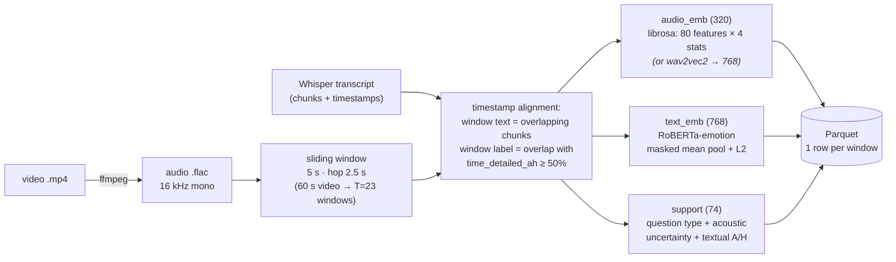
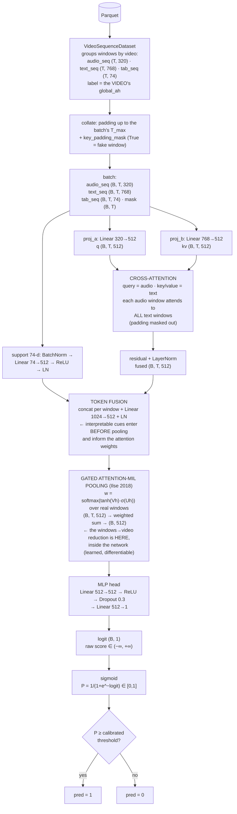
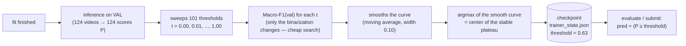

<a id="readme-top"></a>

# BAH AH-Challenge (ABAW11) — Audio + Text

**Multimodal audio + text (no video frames)** pipeline for predicting **ambivalence/hesitancy (A/H)**
in spoken answers — *AH Video Recognition Challenge, 3rd edition (ABAW11 @ ECCV 2026)*.
Task: **video-level binary classification** (`1` = A/H present, `0` = absent). Official
metric: **Macro-F1**.

The approach uses a **sliding window (5 s, hop 2.5 s)** aligning audio ⟷ text via Whisper
timestamps, extracts **text embeddings** (RoBERTa-emotion EN, configurable), **prosodic audio
features** (librosa; wav2vec2/HuBERT available), and **74 psycholinguistic support features**
(question type + acoustic uncertainty + textual hedging/ambivalence). Windows are classified
by a **RandomForest** (baseline, CPU) or fused by a **temporal cross-attention** network with
gated **attention-MIL pooling** (Lightning); the final per-video prediction uses a threshold
calibrated on the validation split.

This repository accompanies the paper
**“Audio-Text Cross-Attention with Psycholinguistic Support Features for
Ambivalence/Hesitancy Recognition”** (LIA — Artificial Intelligence Academic League, PUCPR).
Best internal result: **Macro-F1 0.722 · AP 0.875** on the 525-video public test split —
see [§5](#5-reproducing-the-papers-best-result-ensemble_5) to reproduce it with one command.

<details open="open">
  <summary><b>Table of contents</b></summary>
  <ol>
    <li><a href="#1-requirements">Requirements</a></li>
    <li><a href="#2-installation--initialization">Installation &amp; initialization</a></li>
    <li><a href="#3-dataset">Dataset</a></li>
    <li><a href="#4-quick-start">Quick start</a></li>
    <li><a href="#5-reproducing-the-papers-best-result-ensemble_5">Reproducing the paper's best result (ensemble_5)</a></li>
    <li><a href="#6-make-commands">Commands (make)</a></li>
    <li><a href="#7-running-experiments-hydra">Running experiments (Hydra)</a></li>
    <li><a href="#8-yaml-configuration">YAML configuration</a></li>
    <li><a href="#9-how-the-models-work">How the models work</a></li>
    <li><a href="#10-project-structure">Project structure</a></li>
    <li><a href="#11-outputs--submission">Outputs &amp; submission</a></li>
    <li><a href="#authors--license">Authors &amp; license</a></li>
  </ol>
</details>

---

## 1. Requirements

| Requirement | Version / note |
|-------------|----------------|
| **Python** | ≥ 3.12 |
| **[uv](https://docs.astral.sh/uv/)** | environment/dependency manager |
| **ffmpeg** | **system** dependency (mp4 → flac audio extraction) |
| **GPU** | **optional** — CPU works; **Apple Metal (MPS)** and CUDA supported via `device` |

The **RandomForest path runs 100% on CPU**. The neural model (cross-attention) uses
**PyTorch Lightning**, which is an **optional** dependency (group `neural`).

---

## 2. Installation & initialization

```bash
# 1) uv (if you don't have it yet)
curl -LsSf https://astral.sh/uv/install.sh | sh      # or: brew install uv

# 2) ffmpeg (system)
brew install ffmpeg                                  # macOS  (Linux: apt install ffmpeg)

# 3) project environment (core: RF/CPU + dev tools) — WITHOUT Lightning
make setup            # == uv sync

# 4) (optional) neural cross-attention model — adds Lightning + torchmetrics
make setup-neural     # == uv sync --group neural
```

Everything runs **inside the uv-managed environment** (`uv run …`); no manual venv
activation needed. The package is installed in editable mode (src-layout) and exposes the
`bah` entrypoint (= `main:main`).

**Tracking (Weights & Biases):** W&B is optional. Run `wandb login` once, or run
offline/disabled via config (`wandb.mode=offline|disabled`) or the `WANDB_MODE` env var.
Without an API key the pipeline degrades gracefully to the local Reporter.

```bash
make ffmpeg-check     # confirms ffmpeg
make ci               # fast gate (format-check + lint + compile) — no data needed
```

---

## 3. Dataset

The **BAH** dataset (300 participants, ≤ 7 videos each) must be downloaded from the
challenge (EULA required) and placed under **`data/raw/data/`**:

```
data/raw/data/
├── Videos/<pid>/Visite_1/<pid>_Question_<q>_..._Video.mp4   # raw videos (we only extract the audio)
├── transcription/                                           # Whisper transcripts (chunks + timestamps)
├── split/{train,val,test}.txt                               # participant-wise splits (id, class, transcript)
├── video_annotation_transcript.yaml                         # global_ah (video label) + time_detailed_ah
├── meta_data.yml                                            # per-participant demographic metadata
└── bah-video.csv
```

Paths are configurable in [`configs/data/default.yaml`](configs/data/default.yaml)
(`data.paths.*`). Derived artifacts live in `data/interim/` (`.flac` audio, window index)
and `data/processed/` (Parquet features) — both git-ignored.

---

## 4. Quick start

```bash
# data preparation: extract audio → index/window → embeddings → Parquet
make data                       # featurize uses DEVICE=auto (MPS on Apple Silicon)

# RandomForest baseline (CPU) — trains, calibrates aggregation and evaluates
make train
make evaluate                   # Macro-F1 / AP on the validation split

# neural model (optional)
make setup-neural
make train-neural               # cross-attention, DEVICE=auto (MPS ▸ CUDA ▸ CPU)

# submission file (private test)
make submit                     # SPLIT=test, OUT=outputs/submission.txt
```

Equivalent commands without `make` (raw Hydra): see [§7](#7-running-experiments-hydra).

---

## 5. Reproducing the paper's best result (ensemble_5)

The best configuration reported in the paper (Table 2, *“MIL + 74 support features,
5 seeds”*) is the **5-seed cross-attention ensemble** under the **traditional
train/val/test protocol**:

| Protocol step | Split | Detail |
|---------------|-------|--------|
| Model weights | `train` (778 videos) | 5 identical models, seeds `{42, 1, 2, 3, 4}` |
| Threshold calibration | `val` (124 videos) | ensemble probabilities, `smooth` plateau selection |
| Reported metrics | `test` (525 videos) | **Macro-F1 0.722 · AP 0.875** (threshold 0.50) |

One command runs the whole thing (data prep → 5 trainings → ensemble evaluation):

```bash
make setup-neural       # once: Lightning + torchmetrics
make reproduce-best     # requires the BAH dataset under data/raw/data/ (§3)
```

What it does, step by step (you can also run the steps manually):

```bash
# 1) data preparation — audio extraction, 5 s / 2.5 s windows, librosa 320-d +
#    RoBERTa-emotion 768-d + 74-d support features → data/processed/*.parquet (~30-40 min once)
make data

# 2) trains the 5 members (train split only; checkpoint selection by val AP, early
#    stopping patience 20) and records the run dirs in outputs/cross_attention/ensemble_manifest.txt
make train-ensemble SEEDS="42 1 2 3 4"

# 3) averages the 5 per-video probabilities, recalibrates the threshold on VAL
#    (calibration=smooth: center of the stable near-maximum plateau of the F1×threshold
#    curve) and reports Macro-F1/AP on TEST
make ensemble-evaluate SPLIT=test ENS_CALIB=smooth ARGS="+ensemble_name=ensemble_5"
```

Reports, plots and `metrics.json` land in `outputs/cross_attention/ensemble_5/eval_test/`.

**Expected variance.** Training is not bit-exact across platforms (MPS/CUDA kernels,
shuffle order): each member's AP fluctuates ±0.01, which is precisely why the final model
averages 5 seeds. Expect **Macro-F1 0.72 ± 0.005 and AP ≈ 0.87** on test; the reference
run gives 0.722 / 0.875 with the ensemble threshold at 0.50.

**Notes.**
- The `cross_attention` preset already matches the paper: librosa prosodic audio (320-d),
  RoBERTa-emotion text (768-d), 74-d support features fused **per token**, gated
  **attention-MIL pooling**, dropout 0.3, lr 3e-4, weight decay 0.05 (AdamW), grad-clip 1.0.
- `ENS_CALIB=smooth` matters: with probability averaging the val F1×threshold curve is
  smooth, so plateau-center selection transfers to test (for *single* models `base_rate`
  is the robust default — see [§9.4](#94-threshold-where-it-enters-and-how-it-is-calibrated-common-to-both)).
- A fully **self-contained notebook** version of this pipeline (no dependency on `src/`)
  lives in [notebooks/ensemble5_pipeline.ipynb](notebooks/ensemble5_pipeline.ipynb); it also
  covers the external private-test submission variant (trained on train+val).
- Total runtime on an Apple-Silicon laptop: ~30–40 min of featurization (once) + a few
  minutes per seed (the model saturates in 1–3 epochs).

---

## 6. Make commands

`make help` lists everything. Main targets:

| Group | Target | What it does |
|-------|--------|--------------|
| **Environment** | `setup` · `setup-neural` · `setup-all` | `uv sync` (core) · + `neural` group · everything |
| | `ffmpeg-check` | confirms ffmpeg is installed |
| **Data** | `extract-audio` · `preprocess` · `featurize` · `data` | mp4→flac · index+windows · embeddings→Parquet · all three |
| **Train/eval** | `train` (=`train-rf`) · `train-neural` · `sweep` | RF (CPU) · cross-attention · multirun |
| | `evaluate` · `submit` · `pipeline` | metrics on a split · submission · end to end |
| **Ensemble** | `train-ensemble` · `ensemble-evaluate` · `ensemble-submit` | N seeds · averaged-probability eval · submission |
| | `reproduce-best` | **paper result**: data + 5 seeds + test evaluation |
| **Quality (CI)** | `ci` · `check` | `format-check + lint + compile` · + `typecheck + test` |
| | `lint` · `format` · `typecheck` · `test` · `compile` | ruff · ruff --fix · mypy · pytest · py_compile |
| **Cleaning** | `clean` · `clean-cache` · `clean-outputs` · `clean-all` | caches · `data/interim,processed` · `outputs/…` · everything |

**Parameters** (override on the command line):

```bash
make featurize DEVICE=mps
make evaluate SPLIT=test
make train ARGS="model.n_estimators=800 data.window.size_s=4"
make train-ensemble SEEDS="42 1 2"
make sweep SWEEP="model.lr=1e-3,5e-4 model.num_heads=4,8"
```

`DEVICE` = `auto`(default) `|cpu|mps|cuda` · `SPLIT` = `val|test` · `OUT` = output file ·
`EXPERIMENT` = preset · `ARGS` = extra Hydra overrides · `SWEEP` = multirun grid ·
`SEEDS` = ensemble seeds · `ENS_CALIB` = ensemble threshold calibration (`smooth` default).

---

## 7. Running experiments (Hydra)

The CLI is a **[Hydra](https://hydra.cc/)** entrypoint (`main.py`). The **mode** is chosen
with `mode=` and any parameter can be overridden on the command line:

```bash
uv run python main.py mode=preprocess                       # index + windows
uv run python main.py mode=featurize device=mps             # embeddings → Parquet
uv run python main.py                                       # mode=train (default) — RF baseline
uv run python main.py mode=evaluate split=val
uv run python main.py mode=submit split=test out=outputs/submission.txt
```

**Switching model/embedder** = selecting another file from the group, or using a **preset**:

```bash
# swap individual pieces
uv run python main.py text_embedder=minilm audio_embedder=wav2vec2

# presets (configs/experiment/*) swap several groups at once
uv run python main.py +experiment=rf_baseline               # RF + librosa + sklearn (CPU)
PYTORCH_ENABLE_MPS_FALLBACK=1 \
  uv run python main.py +experiment=cross_attention device=mps   # cross-attention + Lightning
```

**Multirun** (parallel sweep via the joblib launcher):

```bash
uv run python main.py -m model.n_estimators=400,800 data.window.size_s=4,5,6
```

> 🍎 **Device:** `device=auto` resolves to **MPS ▸ CUDA ▸ CPU**. On Apple Silicon the
> neural path exports `PYTORCH_ENABLE_MPS_FALLBACK=1` (the `make train-neural` target
> already does this) to fall back to CPU for ops not yet supported by Metal.

---

## 8. YAML configuration

Configuration is composed from **Hydra groups** in [`configs/`](configs/) — one axis per
directory. The root `config.yaml` lists the defaults; switching an axis means pointing to
another file in the group (`group=file`) or editing the YAML.

```
configs/
├── config.yaml                 # root: defaults list + seed, device, mode, wandb, launcher
├── data/default.yaml           # data.paths.* · data.audio.* · data.window.* · data.tabular
│                               #   + data.train_splits / data.calib_split (protocol splits)
├── text_embedder/              # roberta_emotion (default) · minilm · gte_large · bertimbau
├── audio_embedder/             # librosa (default, CPU) · wav2vec2 · hubert · wav2vec2_emotion
├── model/                      # random_forest (family=sklearn) · cross_attention (family=lightning)
├── trainer/                    # sklearn (CPU) · lightning (accelerator derived from device)
├── aggregation/default.yaml    # method (mean_proba) + threshold (auto, calibrated) + calibration
└── experiment/                 # presets: rf_baseline · cross_attention (= paper config)
```

Most useful knobs:

| Where | Keys | Effect |
|-------|------|--------|
| `config.yaml` | `seed`, `device`, `mode`, `wandb.mode` | seed, device, stage, tracking |
| `data/default.yaml` | `data.window.{size_s,hop_s,min_overlap_for_positive}` | sliding window + window label |
| `data/default.yaml` | `data.paths.*` | dataset and artifact paths |
| `data/default.yaml` | `data.train_splits`, `data.calib_split` | training/calibration protocol (default: `[train]` / `val`) |
| `data/default.yaml` | `data.tabular.*` | 74-d support features (question type, hesitation, text A/H) |
| `text_embedder/*` | `model_name`, `pooling`, `max_length` | text encoder (HuggingFace) |
| `audio_embedder/*` | `backend` (`librosa\|wav2vec2\|hubert`), `n_mfcc`, `agg_stats` | audio features |
| `model/random_forest` | `n_estimators`, `max_depth`, `class_weight` | RF hyperparameters |
| `model/cross_attention` | `common_dim`, `num_heads`, `dropout`, `lr`, `pool`, `tab_fusion` | temporal fusion network |
| `aggregation/default` | `method`, `threshold`, `calibration` | how windows become the video prediction |

Three ways to adjust, in order of convenience:

```bash
# 1) one-off CLI override (does not touch files)
uv run python main.py model.n_estimators=800 text_embedder=minilm

# 2) edit the group file (e.g. configs/model/random_forest.yaml)
# 3) create a preset in configs/experiment/<name>.yaml and use +experiment=<name>
```

---

## 9. How the models work

From raw video to the binary per-video prediction. The **data stage is shared** by both
models; they diverge in *how they consume the windows* and in *where* the windows → video
reduction happens.

### 9.1 Shared stage — windowing + per-window embeddings

A video never becomes "one single embedding": it is sliced into **5-s windows** (hop 2.5 s,
50% overlap) and **each window gets its own feature vector**, aligned to the transcript by
timestamp.



**Central dimension rule:** the video's *duration* only changes **T** (number of windows);
each embedding's *dimension* is fixed, defined by the embedder:

| axis | what it is | where it comes from |
|------|------------|---------------------|
| `T` | number of windows in the video (varies: 2 to 45 in BAH) | duration ÷ hop |
| `320` | audio dim per window (librosa) | 80 features × 4 statistics (mean/std/min/max) |
| `768` | text dim per window (RoBERTa) | fixed hidden size of RoBERTa-base |
| `74` | support features per window | question type (7) + acoustic uncertainty (18) + textual A/H (49) |

> An 8-minute video has T=191 windows — the vectors still have 320/768/74 dims.
> NLP analogy: the window is the **token**; the video is the **sentence**. Long sentences
> have *more* tokens, not "bigger" tokens.


### 9.2 Cross-Attention (family=lightning)

For the neural model, **the sample is the whole video**: the T windows enter *together*,
stacked as a `(T, D)` sequence — and the model emits **1 logit per video directly**, with no
intermediate predictions. The training label is the video's `global_ah` (BCE).



Anatomy (the universal *backbone → pooling → head* pattern):

| component | role | output shape |
|-----------|------|--------------|
| projections | brings audio/text into the common space (512) | `(B, T, 512)` |
| cross-attention | **context**: mixes information across audio↔text windows | `(B, T, 512)` |
| token fusion (support 74-d) | **inductive bias**: uncertainty/ambivalence cues injected per window | `(B, T, 512)` |
| gated MIL pooling | **summary**: learned weighted sum of the T windows | `(B, 512)` |
| MLP head | **decision**: compresses the evidence into the logit | `(B, 1)` |
| sigmoid | normalizes the logit into probability P | `(B, 1)` |
| threshold | converts P into 0/1 (outside the network, calibrated on val) | — |

> **Why MIL?** A/H is temporally sparse — the evidence may live in a few windows. Mean
> pooling gives every window equal weight and dilutes it; gated attention pooling lets the
> few informative windows dominate (`model.pool: mean|attention|max`,
> `model.tab_fusion: late|token` — the paper configuration is `attention` + `token`).

> **Training:** `BCEWithLogits(logit, global_ah)` — the gradient flows through the pooling,
> so the network *learns* how to combine windows (unlike the RF's fixed mean). The loss uses
> the raw logit (not P) for numerical stability.

### 9.4 Threshold: where it enters and how it is calibrated (common to both)

The threshold is **not a network parameter** — it is a post-processing decision rule,
calibrated once on the **calibration split** (default: `val`) and frozen in the checkpoint:



Why smooth instead of the raw peak? With a small val set the F1×threshold curve is jagged
and the raw `argmax` can latch onto a lucky spike that does not transfer (real case in this
repo: `argmax`→0.30 gave F1 0.719 on val but **0.614 on test**; `smooth`→0.63 gave 0.707 on
val and **0.701 on test**). Strategy is configurable via `aggregation.calibration`:
`base_rate` (prevalence matching — robust default for *single* models on a small val),
`smooth` (plateau center — best for the *ensemble*, whose averaged probabilities smooth the
curve), `argmax` (raw peak). Details: [src/training/README.md](src/training/README.md).

> The threshold is learned on the **calibration split**, never on test — calibrating on
> test inflates the metric and does not generalize to the official *hidden test*.

### 9.5 Side-by-side comparison

| | RandomForest | Cross-Attention |
|---|---|---|
| training sample | **window** (label `time_detailed_ah`) | **video** (label `global_ah`) |
| model input | 1 window at a time `(1162,)` | T windows together `(B, T, D)` |
| intermediate predictions | T (one per window) | none |
| windows→video reduction | probability mean (**outside** the model) | attention-MIL pooling (**inside**, learned) |
| cross-window context | none | full (audio↔text attention) |
| per-video output | aggregated score → threshold → 0/1 | logit → sigmoid → P → threshold → 0/1 |
| hardware | CPU | MPS/CUDA (Lightning, optional) |
| final metric | Macro-F1 over **all** videos in the split (there is no "per-video F1") | same |

---

## 10. Project structure

```
.
├── main.py                     # Hydra entrypoint (@hydra.main) — dispatch by cfg.mode
├── Makefile                    # centralized commands (pipeline + CI/CD)
├── pyproject.toml              # deps (uv) — core + `neural`/`dev` groups
├── configs/                    # Hydra groups (see §8)
├── docs/implementation/        # implementation plan (7 phases)
├── notebooks/                  # incl. ensemble5_pipeline.ipynb (self-contained best model)
├── data/                       # raw/ (dataset) · interim/ (audio, windows) · processed/ (features)
└── src/
    ├── conf/                   # typed schemas + resolve_device + seed_everything
    ├── logger.py
    ├── base/                   # ABCs: BaseEmbedder, BaseModel, BaseTrainer
    ├── data/                   # indexing, audio_io, windowing, datasets, schema
    ├── features/               # text_embedder, audio_embedder, hesitation, text_features, tabular, builder
    ├── models/                 # registry, random_forest, cross_attention
    ├── training/               # factory, sklearn_trainer, lightning_trainer, ensemble, aggregation, metrics, splits
    ├── outputs/                # wandb_logger, checkpoint, reporter, submission
    ├── pipeline/               # preprocess, featurize (orchestration)
    └── scripts/                # extract_audio (mp4 → flac 16 kHz)
```

---

## Citation

If you use this code or build on our results, please cite the paper
([arXiv:2607.13345](https://arxiv.org/abs/2607.13345)):

```bibtex
@article{martins2026audiotext,
  title   = {Audio-Text Cross-Attention with Psycholinguistic Support Features
             for Ambivalence/Hesitancy Recognition},
  author  = {Martins, Luiz F. B. F. and Pisaia, Rodrigo W. and Girardi, Matheus M.
             and Berkembrock, Isabella and Almeida, Jo{\~a}o A. and Hochuli, Andr{\'e} G.
             and Laroca, Rayson and Britto Jr., Alceu S.},
  journal = {arXiv preprint arXiv:2607.13345},
  year    = {2026},
  doi     = {10.48550/arXiv.2607.13345},
  url     = {https://arxiv.org/abs/2607.13345}
}
```

<p align="right">(<a href="#readme-top">back to top</a>)</p>

---

## Authors & license

- **LIA — Artificial Intelligence Academic League (PUCPR)** — contact:
  [Matheus Girardi](mailto:matheusmgirardi@gmail.com) ·
  [Luiz Fernando](mailto:lf.fonseca.0808@gmail.com)
- Paper: [*Audio-Text Cross-Attention with Psycholinguistic Support Features for
  Ambivalence/Hesitancy Recognition*](https://arxiv.org/abs/2607.13345) (ABAW11 @ ECCV 2026,
  [arXiv:2607.13345](https://arxiv.org/abs/2607.13345)).
- License: see [LICENSE](LICENSE).

<p align="right">(<a href="#readme-top">back to top</a>)</p>
