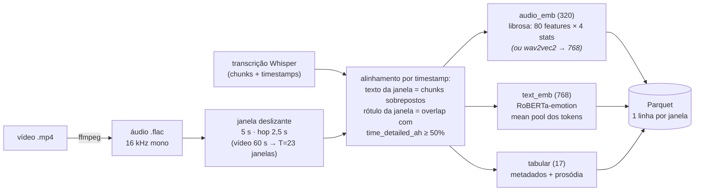
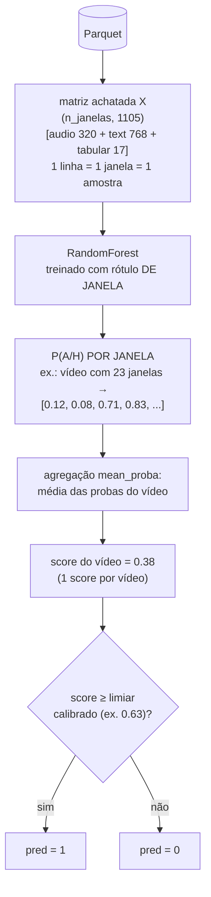
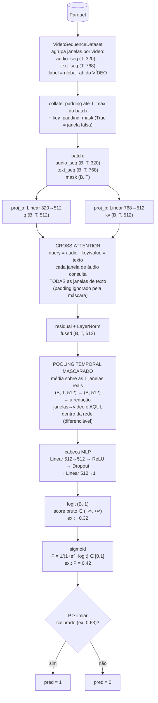
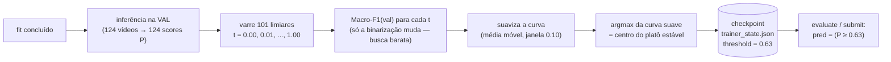

<a id="readme-top"></a>

# BAH AH-Challenge (ABAW11) — Áudio + Texto

Pipeline **multimodal áudio + texto (sem vídeo)** para prever **ambivalência/hesitação (A/H)**
em respostas faladas — *AH Video Recognition Challenge, 3ª edição (ABAW11 @ ECCV 2026)*.
Tarefa: **classificação binária a nível de vídeo** (`1` = há A/H, `0` = não há). Métrica
oficial: **Macro-F1**.

A abordagem usa uma **janela deslizante (5 s, hop 2,5 s)** alinhando áudio ⟷ texto por
timestamps do Whisper, extrai **embeddings de texto** (RoBERTa-emotion EN, configurável) e
**features de áudio** (LIBROSA ou wav2vec2/HuBERT), e classifica cada janela com um
**RandomForest** (baseline, CPU) ou uma **cross-attention temporal** (Lightning, opcional);
a predição final por vídeo vem da **agregação das janelas** com limiar calibrado.

> 📚 Projeto, decisões de arquitetura e detalhes de cada módulo:
> **[docs/implementation/](docs/implementation/README.md)** (plano em 7 fases).

<details open="open">
  <summary><b>Índice</b></summary>
  <ol>
    <li><a href="#1-requisitos">Requisitos</a></li>
    <li><a href="#2-instalação--inicialização">Instalação &amp; inicialização</a></li>
    <li><a href="#3-dataset">Dataset</a></li>
    <li><a href="#4-início-rápido">Início rápido</a></li>
    <li><a href="#5-comandos-make">Comandos (make)</a></li>
    <li><a href="#6-rodando-experimentos-hydra">Rodando experimentos (Hydra)</a></li>
    <li><a href="#7-configuração-dos-yaml">Configuração dos YAML</a></li>
    <li><a href="#8-como-os-modelos-funcionam">Como os modelos funcionam</a></li>
    <li><a href="#9-estrutura-do-projeto">Estrutura do projeto</a></li>
    <li><a href="#10-saídas--submissão">Saídas &amp; submissão</a></li>
    <li><a href="#autores--licença">Autores &amp; licença</a></li>
  </ol>
</details>

---

## 1. Requisitos

| Requisito | Versão / nota |
|-----------|---------------|
| **Python** | ≥ 3.12 |
| **[uv](https://docs.astral.sh/uv/)** | gerenciador de ambiente/dependências |
| **ffmpeg** | dependência de **sistema** (extração de áudio mp4 → flac) |
| **GPU** | **opcional** — CPU funciona; **Apple Metal (MPS)** e CUDA suportados via `device` |

O caminho **RandomForest roda 100% em CPU**. O modelo neural (cross-attention) usa
**PyTorch Lightning**, que é uma dependência **opcional** (grupo `neural`).

---

## 2. Instalação & inicialização

```bash
# 1) uv (se ainda não tiver)
curl -LsSf https://astral.sh/uv/install.sh | sh      # ou: brew install uv

# 2) ffmpeg (sistema)
brew install ffmpeg                                  # macOS  (Linux: apt install ffmpeg)

# 3) ambiente do projeto (core: RF/CPU + ferramentas de dev) — SEM Lightning
make setup            # == uv sync

# 4) (opcional) modelo neural cross-attention — adiciona Lightning + torchmetrics
make setup-neural     # == uv sync --group neural
```

Tudo roda **dentro do ambiente gerenciado pelo `uv`** (`uv run …`); não é preciso ativar
venv na mão. O pacote é instalado em modo editável (src-layout) e expõe o entrypoint
`bah` (= `main:main`).

**Tracking (Weights & Biases):** o W&B é opcional. Faça `wandb login` uma vez, ou rode
offline/desligado pelo config (`wandb.mode=offline|disabled`) ou pela env `WANDB_MODE`.

```bash
make ffmpeg-check     # confirma o ffmpeg
make ci               # gate rápido (format-check + lint + compile) — não precisa de dados
```

---

## 3. Dataset

O dataset **BAH** (300 participantes, ≤ 7 vídeos cada) deve ser baixado do desafio (requer
aceite da EULA) e colocado sob **`data/raw/data/`**:

```
data/raw/data/
├── Videos/<pid>/Visite_1/<pid>_Question_<q>_..._Video.mp4   # vídeos brutos (extraímos só o áudio)
├── transcription/                                           # transcrição Whisper (chunks + timestamps)
├── split/{train,val,test}.txt                               # splits participant-wise (id, classe, transcrição)
├── video_annotation_transcript.yaml                         # global_ah (rótulo de vídeo) + time_detailed_ah
├── meta_data.yml                                            # metadados demográficos por participante
└── bah-video.csv
```

Os caminhos são configuráveis em [`configs/data/default.yaml`](configs/data/default.yaml)
(`data.paths.*`). Artefatos derivados ficam em `data/interim/` (áudio `.flac`, índice de
janelas) e `data/processed/` (features em Parquet) — ambos ignorados pelo git.

---

## 4. Início rápido

```bash
# preparação dos dados: extrai áudio → indexa/janela → embeddings → Parquet
make data                       # featurize usa DEVICE=auto (MPS no Apple Silicon)

# baseline RandomForest (CPU) — treina, calibra agregação e avalia
make train
make evaluate                   # Macro-F1 / AP no split de validação

# modelo neural (opcional, Apple Metal)
make setup-neural
make train-neural               # cross-attention, device=mps + fallback p/ CPU

# arquivo de submissão (private test)
make submit                     # SPLIT=test, OUT=outputs/submission.txt
```

Equivalentes sem `make` (Hydra direto): ver [§6](#6-rodando-experimentos-hydra).

---

## 5. Comandos (make)

`make help` lista tudo. Principais alvos:

| Grupo | Alvo | O que faz |
|-------|------|-----------|
| **Ambiente** | `setup` · `setup-neural` · `setup-all` | `uv sync` (core) · + grupo `neural` · tudo |
| | `ffmpeg-check` | confirma o ffmpeg instalado |
| **Dados** | `extract-audio` · `preprocess` · `featurize` · `data` | mp4→flac · índice+janelas · embeddings→Parquet · os 3 |
| **Treino/aval.** | `train` (=`train-rf`) · `train-neural` · `sweep` | RF (CPU) · cross-attention (MPS) · multirun |
| | `evaluate` · `submit` · `pipeline` | métricas num split · submissão · ponta a ponta |
| **Qualidade (CI)** | `ci` · `check` | `format-check + lint + compile` · + `typecheck + test` |
| | `lint` · `format` · `typecheck` · `test` · `compile` | ruff · ruff --fix · mypy · pytest · py_compile |
| **Limpeza** | `clean` · `clean-cache` · `clean-outputs` · `clean-all` | caches · `data/interim,processed` · `outputs/…` · tudo |

**Parâmetros** (sobrescreva na linha de comando):

```bash
make featurize DEVICE=mps
make evaluate SPLIT=test
make train ARGS="model.n_estimators=800 data.window.size_s=4"
make sweep SWEEP="model.lr=1e-3,5e-4 model.num_heads=4,8"
```

`DEVICE` = `auto`(default) `|cpu|mps|cuda` · `SPLIT` = `val|test` · `OUT` = arquivo de saída ·
`EXPERIMENT` = preset · `ARGS` = overrides Hydra extras · `SWEEP` = grade do multirun.

---

## 6. Rodando experimentos (Hydra)

A CLI é um entrypoint **[Hydra](https://hydra.cc/)** (`main.py`). O **modo** é escolhido por
`mode=` e qualquer parâmetro pode ser sobrescrito na linha de comando:

```bash
uv run python main.py mode=preprocess                       # índice + janelas
uv run python main.py mode=featurize device=mps             # embeddings → Parquet
uv run python main.py                                       # mode=train (default) — RF baseline
uv run python main.py mode=evaluate split=val
uv run python main.py mode=submit split=test out=outputs/submission.txt
```

**Trocar de modelo/embedder** = selecionar outro arquivo do grupo, ou usar um **preset**:

```bash
# trocar peças individuais
uv run python main.py text_embedder=minilm audio_embedder=wav2vec2

# presets (configs/experiment/*) trocam vários grupos de uma vez
uv run python main.py +experiment=rf_baseline               # RF + librosa + sklearn (CPU)
PYTORCH_ENABLE_MPS_FALLBACK=1 \
  uv run python main.py +experiment=cross_attention device=mps   # cross-attention + wav2vec2 + Lightning
```

**Multirun** (varredura paralela via launcher joblib):

```bash
uv run python main.py -m model.n_estimators=400,800 data.window.size_s=4,5,6
```

> 🍎 **Device:** `device=auto` resolve para **MPS ▸ CUDA ▸ CPU**. No Apple Silicon, o caminho
> neural exporta `PYTORCH_ENABLE_MPS_FALLBACK=1` (o alvo `make train-neural` já faz isso) para
> cair em CPU nas operações ainda não suportadas pelo Metal.

---

## 7. Configuração dos YAML

A configuração é composta por **grupos Hydra** em [`configs/`](configs/) — um eixo por
diretório. O `config.yaml` raiz lista os defaults; trocar um eixo é só apontar outro arquivo
do grupo (`grupo=arquivo`) ou editar o YAML.

```
configs/
├── config.yaml                 # raiz: defaults list + seed, device, mode, wandb, launcher
├── data/default.yaml           # data.paths.* · data.audio.* · data.window.* · data.tabular
├── text_embedder/              # roberta_emotion (default) · minilm · bertimbau
├── audio_embedder/             # librosa (default, CPU) · wav2vec2 · hubert
├── model/                      # random_forest (family=sklearn) · cross_attention (family=lightning)
├── trainer/                    # sklearn (CPU) · lightning (accelerator derivado do device)
├── aggregation/default.yaml    # método (mean_proba) + limiar (auto, calibrado na val)
└── experiment/                 # presets: rf_baseline · cross_attention
```

Blocos mais úteis para calibrar:

| Onde | Chaves | Efeito |
|------|--------|--------|
| `config.yaml` | `seed`, `device`, `mode`, `wandb.mode` | semente, dispositivo, etapa, tracking |
| `data/default.yaml` | `data.window.{size_s,hop_s,min_overlap_for_positive}` | janela deslizante + rótulo da janela |
| `data/default.yaml` | `data.paths.*` | caminhos do dataset e dos artefatos |
| `text_embedder/*` | `model_name`, `pooling`, `max_length` | encoder de texto (HuggingFace) |
| `audio_embedder/*` | `backend` (`librosa\|wav2vec2\|hubert`), `n_mfcc`, `agg_stats` | features de áudio |
| `model/random_forest` | `n_estimators`, `max_depth`, `class_weight` | hiperparâmetros do RF |
| `model/cross_attention` | `common_dim`, `num_heads`, `dropout`, `lr` | rede de fusão temporal |
| `aggregation/default` | `method`, `threshold` | como janelas viram a predição do vídeo |

Três formas de ajustar, em ordem de praticidade:

```bash
# 1) override pontual na CLI (não altera arquivos)
uv run python main.py model.n_estimators=800 text_embedder=minilm

# 2) editar o arquivo do grupo (ex.: configs/model/random_forest.yaml)
# 3) criar um preset em configs/experiment/<nome>.yaml e usar +experiment=<nome>
```

> ⚠️ **Idioma do texto:** as transcrições do BAH são em **inglês**; o default é
> `cardiffnlp/twitter-roberta-base-emotion` (RoBERTa EN). Não use o `bertimbau` (PT) sobre o
> texto original — só com tradução. Detalhes em [docs §8](docs/implementation/README.md).

---

## 8. Como os modelos funcionam

Do vídeo bruto até a predição binária por vídeo. A **etapa de dados é compartilhada**
pelos dois modelos; eles divergem em *como consomem as janelas* e em *onde* acontece a
redução janelas → vídeo.

### 8.1 Etapa compartilhada — janelamento + embeddings por janela

O vídeo nunca vira "um embedding só": ele é fatiado em **janelas de 5 s** (hop 2,5 s,
50% de sobreposição) e **cada janela recebe seu próprio vetor de features**, alinhado à
transcrição por timestamp.



**Regra central de dimensões:** a *duração* do vídeo só muda **T** (nº de janelas);
a *dimensão* de cada embedding é fixa, definida pelo embedder:

| eixo | o que é | de onde vem |
|------|---------|-------------|
| `T` | nº de janelas do vídeo (varia: 2 a 45 no BAH) | duração ÷ hop |
| `320` | dim do áudio por janela (librosa) | 80 features × 4 estatísticas (mean/std/min/max) |
| `768` | dim do texto por janela (RoBERTa) | hidden size fixo do RoBERTa-base |

> Um vídeo de 8 min tem T=191 janelas — os vetores continuam com 320/768 dims.
> Analogia com NLP: a janela é o **token**; o vídeo é a **frase**. Frases longas têm
> *mais* tokens, não tokens "maiores".

### 8.2 Caminho A — RandomForest (family=sklearn, CPU)

Para o RF, **cada janela é uma amostra independente** de treino, com rótulo próprio de
janela (`time_detailed_ah`). A noção de vídeo só entra **depois**, na agregação
estatística das probabilidades.



Características: T predições intermediárias (uma por janela), redução janelas→vídeo
**fora do modelo** (pós-processamento, `src/training/aggregation.py`), 100% CPU.

### 8.3 Caminho B — Cross-Attention (family=lightning)

Para o neural, **a amostra é o vídeo inteiro**: as T janelas entram *juntas*, empilhadas
como sequência `(T, D)` — e o modelo emite **1 logit por vídeo direto**, sem predições
intermediárias nem média. O rótulo de treino é o `global_ah` do vídeo (BCE).



Anatomia (o padrão universal *backbone → pooling → head*):

| componente | papel | shape de saída |
|------------|-------|----------------|
| projeções | leva áudio/texto ao espaço comum (512) | `(B, T, 512)` |
| cross-attention | **contexto**: mistura informação entre janelas áudio↔texto | `(B, T, 512)` |
| pooling mascarado | **resumo**: colapsa as T janelas em 1 vetor por vídeo | `(B, 512)` |
| cabeça MLP | **decisão**: comprime as evidências no logit | `(B, 1)` |
| sigmoid | normaliza o logit em probabilidade P | `(B, 1)` |
| limiar | converte P em 0/1 (fora da rede, calibrado na val) | — |

> **Treino:** `BCEWithLogits(logit, global_ah)` — o gradiente atravessa o pooling, então
> a rede *aprende* a combinar as janelas (diferente da média fixa do RF). A loss usa o
> logit cru (não o P) por estabilidade numérica.

### 8.4 Limiar: onde entra e como é calibrado (comum aos dois)

O limiar **não é um parâmetro da rede** — é uma regra de decisão pós-processamento,
calibrada uma única vez na **validação** e congelada no checkpoint:



Por que suavizar em vez do pico cru? Com val pequena a curva F1×limiar é serrilhada e o
`argmax` pode fisgar um pico de sorte que não transfere (caso real deste repo:
`argmax`→0.30 deu F1 0.719 na val mas **0.614 no test**; `smooth`→0.63 deu 0.707 na val
e **0.701 no test**). Detalhes: [src/training/README.md](src/training/README.md).

> ⚠️ O limiar aprende-se na **val**, nunca no test — calibrar no test infla a métrica e
> não generaliza para o *hidden test* oficial.

### 8.5 Comparação lado a lado

| | RandomForest | Cross-Attention |
|---|---|---|
| amostra de treino | **janela** (rótulo `time_detailed_ah`) | **vídeo** (rótulo `global_ah`) |
| entrada do modelo | 1 janela por vez `(1105,)` | T janelas juntas `(B, T, D)` |
| predições intermediárias | T (uma por janela) | nenhuma |
| redução janelas→vídeo | média das probas (**fora** do modelo) | pooling temporal (**dentro**, aprendido) |
| contexto entre janelas | nenhum | total (atenção áudio↔texto) |
| saída por vídeo | score agregado → limiar → 0/1 | logit → sigmoid → P → limiar → 0/1 |
| hardware | CPU | MPS/CUDA (Lightning, opcional) |
| métrica final | Macro-F1 sobre **todos** os vídeos do split (não existe "F1 por vídeo") | idem |

---

## 9. Estrutura do projeto

```
.
├── main.py                     # entrypoint Hydra (@hydra.main) — dispatch por cfg.mode
├── Makefile                    # comandos centralizados (pipeline + CI/CD)
├── pyproject.toml              # deps (uv) — core + grupos `neural`/`dev`
├── configs/                    # grupos Hydra (ver §7)
├── docs/implementation/        # plano de implementação (7 fases)
├── data/                       # raw/ (dataset) · interim/ (áudio, janelas) · processed/ (features)
└── src/
    ├── conf/                   # schemas tipados + resolve_device + seed_everything
    ├── logger.py
    ├── base/                   # ABCs: BaseEmbedder, BaseModel, BaseTrainer
    ├── data/                   # indexing, audio_io, windowing, datasets, schema
    ├── features/               # text_embedder, audio_embedder, tabular, builder
    ├── models/                 # registry, random_forest, cross_attention
    ├── training/               # factory, sklearn_trainer, lightning_trainer, aggregation, metrics, splits
    ├── outputs/                # wandb_logger, checkpoint, reporter, submission
    ├── pipeline/               # preprocess, featurize (orquestração)
    └── scripts/                # extract_audio (mp4 → flac 16 kHz)
```

---

## 10. Saídas & submissão

- Cada run grava em `outputs/<experiment_name>/<timestamp>/` (checkpoint, métricas, plots) e,
  se habilitado, no **W&B**. O Reporter local sempre roda como fallback offline.
- `make submit` (ou `mode=submit`) gera o arquivo de predições a nível de vídeo
  (`video_id, pred`) em `OUT` (default `outputs/submission.txt`).
- Métrica oficial: **Macro-F1 a nível de vídeo**; *private test* é enviado por e-mail
  (≤ 5 trials/semana, melhor conta).

---

## Autores & licença

- **Liga IA** — [Matheus Girardi](mailto:matheusmgirardi@gmail.com) ·
  [Luiz Fernando](mailto:lf.fonseca.0808@gmail.com)
- Licença: ver [LICENSE](LICENSE).

<p align="right">(<a href="#readme-top">voltar ao topo</a>)</p>
