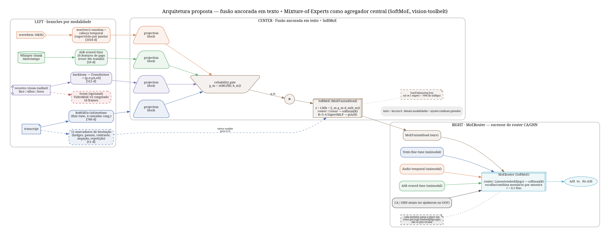
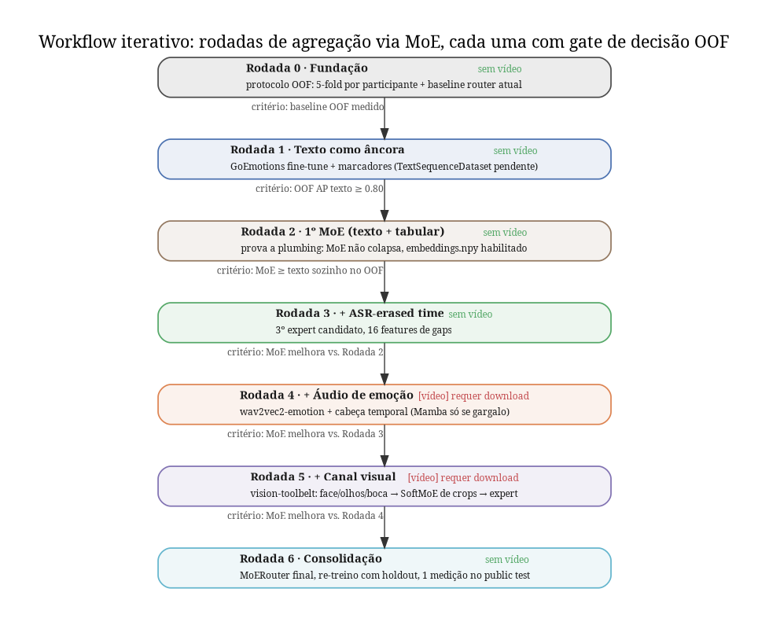

# Plano v2: workflow iterativo de agregação de sinais via MoE

## Figuras

Geradas por `scripts/plot_improvement_plan.py` (Graphviz/`dot`, PNG + PDF em `docs/figures/`).

## Por que reestruturar (contexto desta revisão)

O plano original (`docs/improvement_plan.md`, já parcialmente implementado —
F0/F1/F2a; contexto e arquivos herdados resumidos mais abaixo) era uma sequência
linear F0→F4: cada fase
adicionava um sinal nas suas próprias configs/modelos, e só na Fase 4 tudo convergia
num único "Text Residual Fusion" com um gate escalar por modalidade.

Essa estrutura tem um problema: só saberíamos se a aposta estava certa no fim, depois
de já ter implementado tudo. O pedido desta revisão é trocar isso por um **workflow
iterativo**: a cada sinal novo adicionado, rodar o protocolo OOF (já existe, Fase 0) e
decidir *na hora* se aquele sinal entra ou não — nunca acumular trabalho não validado.

A peça central dessa mudança é o **Mixture-of-Experts**: em vez de um MLP fixo no fim
da fusão e um router separado (regressão logística) decidindo entre CA/GNN, o MoE vira
o **único mecanismo de agregação**, usado em dois níveis:
1. Como classificador final de qualquer sub-fusão (troca o `MLP classifier` do Text
   Residual Fusion).
2. Como sucessor do router atual (`scripts/meta_router_ca_gnn.py`), decidindo por
   amostra qual membro (ou combinação) confiar — generalização natural do reliability
   gate `g_m = σ(MLP[b;h_m])` já desenhado, só que com K experts em vez de 1 peso por
   modalidade.

Cada "rodada" do workflow (ver abaixo) testa se um MoE com mais um sinal bate o MoE
anterior no protocolo OOF (`src/eval/protocol.py`, já implementado). Se não bater, o
sinal fica registrado como "testado, não incorporado" — nunca é descartado
silenciosamente, mas também nunca infla a arquitetura sem provar valor.

**Mamba**: pesquisado (vision-toolbelt-liga tem um backbone Mamba solto, não integrado
ao MoE por padrão; `mamba-ssm`/`causal-conv1d` não estão instalados no projeto e
exigem build com kernels CUDA compilados). RAS só usa Mamba numa sequência curta (16
frames de cena) — no nosso caso as sequências temporais também são curtas (janelas de
5s). Decisão: Mamba **não entra como default** em nenhuma cabeça temporal; fica marcado
como experimento opcional na Rodada 4 (áudio/cena), a testar só se a cabeça temporal
simples (GRU/Transformer pequeno) virar gargalo de custo comprovado — nunca bloqueia
uma rodada.

---

## Mecanismo central: `SoftMoE` como agregador único

**Fonte:** `SoftMoE` em
`/home/rwp/code/project_lib/vision-toolbelt-liga/src/vision_toolbelt/architectures/moe.py`.
Já é backbone-agnóstico — aceita `(B, C)` (vetores de embedding) diretamente, sem
precisar da parte de CNN do `MoEClassificationModel`/`build_moe_classifier` (essa parte
é só para imagem). Roteamento denso/soft: `router = Linear(in_features, num_experts)`,
softmax sobre todos os experts, cada expert é um `ExpertMLP` (2 camadas, GELU,
dropout), saída combinada por soma ponderada. Sem loss de balanceamento de carga no
código original — **a adicionar** se um expert monopolizar o roteamento (ver Rodada 2).

**Novo módulo** `src/models/moe_fusion.py`, dois usos concretos:

1. **`MoEFusionHead`** — substitui o `MLP classifier` do Text Residual Fusion. Entrada:
   o vetor fundido `z = LN(b_text + Σ_m g_m·d_m(h_m))` (mesma equação de antes, texto
   como âncora). Saída: `SoftMoE(z) → Linear(K→2)`. K experts pequenos (3–4 pra
   começar) se especializam em diferentes "modos" de conflito A/H (hesitação verbal vs.
   microexpressão vs. pausa longa), em vez de um único MLP compartilhado ter que cobrir
   todos.
2. **`MoERouter`** — sucessor do router atual (`scripts/meta_router_ca_gnn.py`).
   Diferença importante descoberta na exploração: o router hoje só enxerga
   **probabilidades escalares** por membro (`predictions.csv` com `video_id, y_true,
   y_proba`), nunca embeddings — então um MoE de verdade (que ganha ao ver features,
   não só a probabilidade final) exige plumbing novo: estender o dump de predições
   para incluir o vetor pré-logit de cada membro (`outputs/<run>/eval_<split>/
   embeddings.npy` ou coluna serializada no mesmo CSV). Isso vai na Rodada 2 abaixo,
   não antes — é o primeiro ponto onde "MoE de verdade" diverge do router antigo.

**Regra de balanceamento:** se, ao inspecionar os pesos do router (`softmax` médio por
expert no conjunto OOF), um expert concentrar >70% do tráfego, adicionar uma
load-balancing loss leve (ex.: penalizar desvio da distribuição uniforme de uso dos
experts, receita padrão de Switch Transformer / Shazeer et al.) — só se o desbalanceio
for medido, não preventivamente.

---

## Workflow: rodadas iterativas, cada uma com gate de decisão

Cada rodada segue o mesmo ciclo: **adicionar 1 sinal → treinar o membro unimodal →
testar como expert candidato no MoE → medir no OOF (`src/eval/protocol.py`) → decidir**.
Nenhuma rodada decide "no escuro"; cada uma responde explicitamente "estamos indo na
direção certa?" antes de abrir a próxima.

### Rodada 0 — Fundação (já implementada, branch `improve-macro-f1-beyond-router`)
- Protocolo OOF (`src/eval/protocol.py`): 5-fold agrupado por participante, Macro-F1/AP
  com τ=0.5 fixo, bootstrap pareado.
- Baseline: router atual (CA⊕GNN) reavaliado nesse protocolo, para saber quanto do
  0.7454 é sorte do val de 124 vídeos vs. sinal real.
- **Gate de saída:** baseline OOF documentado — é a régua contra a qual toda rodada
  seguinte se mede. *(Concluído.)*

### Rodada 1 — Texto como âncora (já implementada, precisa de 1 peça: dataset tokenizado)
- `src/models/text_finetune.py`: RoBERTa-GoEmotions fine-tune + cabeça auxiliar de
  marcadores de hesitação (peso 0.3), já implementado e testado.
- **Pendência bloqueante:** falta `TextSequenceDataset` (tokeniza transcript bruto por
  vídeo) — hoje só existem consumidores de embeddings pré-computados. Sem isso o
  treino real não roda.
- **Gate de saída:** treinar de fato e medir OOF AP do texto sozinho. Critério ≥ 0.80
  (referência dos dois papers). Só passa para a Rodada 2 se isso for atingido — texto é
  a âncora de todo o resto, um texto fraco compromete a arquitetura inteira.

### Rodada 2 — Primeiro MoE: 2 experts (texto + tabular/hesitação)
- Implementar `src/models/moe_fusion.py` (`MoEFusionHead`) com **apenas 2 sinais**:
  texto fine-tunado (Rodada 1) e as 74 features tabulares existentes.
- Objetivo desta rodada não é ganhar performance ainda — é **provar a plumbing**: MoE
  treina, roteia de forma sensata (não colapsa num único expert), e bate (ou empata) o
  texto sozinho no OOF.
- Estender o dump de `predictions.csv` para incluir embeddings pré-logit por membro
  (`outputs/<run>/eval_<split>/embeddings.npy`), habilitando o `MoERouter` para as
  rodadas seguintes.
- **Gate de saída:** MoE(texto, tabular) ≥ texto sozinho no OOF, com IC do bootstrap
  não incluindo 0 como piora. Se o MoE só empatar ou piorar aqui, é sinal de bug na
  plumbing, não de falta de sinal — não passar para a Rodada 3 sem resolver.

### Rodada 3 — ASR-erased time entra como terceiro expert
- `src/features/asr_timing.py` já implementado e testado (16 features de gaps).
- Resolver a pendência de wiring (vetor por vídeo replicado nas janelas, conforme já
  recomendado no plano original) e adicionar como 3º expert candidato no MoE.
- **Gate de saída:** MoE(texto, tabular, asr_timing) > MoE da Rodada 2 no OOF. Se não
  bater, ASR-timing fica registrado como "testado, não incorporado" — não é descartado
  do código, só não entra no ensemble final.

### Rodada 4 — Áudio de emoção (bloqueada até download do áudio)
- Trocar librosa por `wav2vec2` de emoção + cabeça temporal (GRU/Transformer pequeno
  por padrão; Mamba como experimento tracejado, só se a cabeça padrão for
  comprovadamente o gargalo).
- Supervisão auxiliar por janela via `time_detailed_ah` (já existe em
  `src/data/windowing.py:185-194`).
- **Gate de saída:** MoE com áudio > MoE da Rodada 3 no OOF. Mesma regra de
  "testado, não incorporado" se não bater.

### Rodada 5 — Canal visual (bloqueada até download dos vídeos)
- Extração via `vision-toolbelt-liga`: `FaceDetectionCrop`/`EyesMeshCrop`/
  `MouthMeshCrop` → backbone (`BACKBONES.build`) → estatísticas `[μ,σ,μΔ,σΔ]`.
- Aqui o `SoftMoE` da toolbelt pode ser reaproveitado **duas vezes**: (a) combinando os
  3 crops (face/olhos/boca) antes de entrar como expert único no MoE principal, e (b)
  no MoE principal em si. Documentar as duas instâncias sem confundir escopos.
- Canal de cena (VideoMAE-v2, 16 frames) só entra se sobrar tempo — é o canal mais
  fraco nos dois papers de referência.
- **Gate de saída:** MoE com face > MoE da Rodada 4 no OOF.

### Rodada 6 — Consolidação e submissão
- MoE final com todos os experts que passaram no gate das rodadas anteriores.
- Re-treino em train+val+test com holdout estratificado de ~8% (receita já definida no
  plano original).
- Medição **única** no public test — nunca antes disso.
- Checar taxa de positivos prevista no private test (~50–55%, referência do baseline
  atual).

**Regra transversal de todas as rodadas:** o gate de decisão usa sempre
`paired_bootstrap_macro_f1` (`src/eval/protocol.py`) comparando MoE-com-sinal-novo vs.
MoE-sem-sinal-novo no mesmo conjunto OOF — nunca comparação informal de números soltos.

## Contexto herdado do plano original (ainda válido)

- **Produção hoje:** meta-router CA⊕GNN (áudio librosa + texto `twitter-roberta-emotion`
  + 74 features tabulares). Faz **0.724 no val** e **0.7454 no public test**. Pesos, C,
  τ e limiar do router escolhidos juntos no val de 124 vídeos (`scripts/meta_router_ca_gnn.py`)
  — é exatamente o padrão de overfitting que o protocolo OOF (Rodada 0) existe para medir.
- **Oráculo CA/GNN:** ~0.80 no test se sempre se escolhesse o melhor dos dois — ainda há
  ganho de roteamento/complementaridade não capturado, reforçando a aposta em MoE.
- **Referências:** RAS (2º lugar) fez 0.782 no private test com um único modelo
  text-residual. IISERB (1º lugar) mostrou que calibrar no val pequeno custa até 4 pontos.
- **Onde estamos fracos** (ver `references/visual_signal_lessons_from_top_teams.md`):
  texto com encoder de emoção genérico (não GoEmotions) e congelado; áudio só com
  prosódia (librosa), sem encoder de emoção; face com só 2 frames/janela e landmarks
  crus; sem canal de cena; sem uso do timing apagado pelo ASR.
- **Restrições:** vídeos brutos fora da máquina até novo download; GPU RTX 3060 12GB;
  usar a `vision-toolbelt-liga` do usuário para tudo relacionado a extração visual e MoE.

## Arquivos (consolidado)

- **Já implementados** (branch `improve-macro-f1-beyond-router`): `src/eval/protocol.py`,
  `scripts/ensemble_ap.py`, `src/features/asr_timing.py`, `src/models/text_finetune.py`.
- **A criar nas próximas rodadas:** `src/models/moe_fusion.py` (Rodada 2),
  `TextSequenceDataset` (Rodada 1, bloqueante), extensão do dump de predições para
  embeddings (Rodada 2), `src/pipeline/featurize_face_frames.py` (Rodada 5), configs
  Hydra correspondentes em `configs/model/`, `configs/experiment/`, `configs/audio_embedder/`.
- **Reuso:** janelas/rótulos `src/data/windowing.py`; Whisper `src/data/schema.py`;
  tabular `configs/data/default.yaml`; leitura de predições
  `scripts/meta_router_ca_gnn_face.py:85-106`; ROI `src/data/face_roi.py`;
  `vision_toolbelt` (já registrado como dependência local editável).
- **Docs:** cada rodada concluída ganha uma entrada em `references/` com os números OOF
  medidos, e uma linha em `CHANGELOG.md` sob `[Unreleased]`.

## Próximos passos imediatos desta revisão

1. Atualizar `docs/improvement_plan.md` para refletir esta estrutura em rodadas (substitui
   as seções de Fase 0–4 pelo conteúdo deste plano).
2. Regenerar `docs/figures/architecture.png` (`scripts/plot_improvement_plan.py`, Graphviz)
   mostrando o MoE como agregador central — troca o `MLP classifier` por `SoftMoE` no
   diagrama, e adiciona o `MoERouter` substituindo o router antigo no painel RIGHT.
3. Resolver a pendência bloqueante da Rodada 1 (`TextSequenceDataset`) antes de qualquer
   treino real — é o único item que impede a Rodada 1 de fechar seu gate.
4. Implementar `src/models/moe_fusion.py` (Rodada 2) assim que a Rodada 1 fechar.

## Verificação (aplicável a toda rodada)

- `uv run pytest` deve passar antes de qualquer gate de decisão ser avaliado.
- `make ci` (ruff) limpo.
- Toda rodada produz `outputs/<run>/oof_predictions.csv` e a tabela OOF (F1, AP, IC do
  bootstrap) comparando com/sem o sinal novo — é o artefato que sustenta o gate de saída.
- O public test só é avaliado **uma vez**, na Rodada 6 (consolidação) — nunca antes.
- Submissão final: re-treino com todos os dados + holdout de 8%, checando que a taxa de
  positivos prevista no private fica em torno de 50–55% (mesma faixa do baseline atual).
