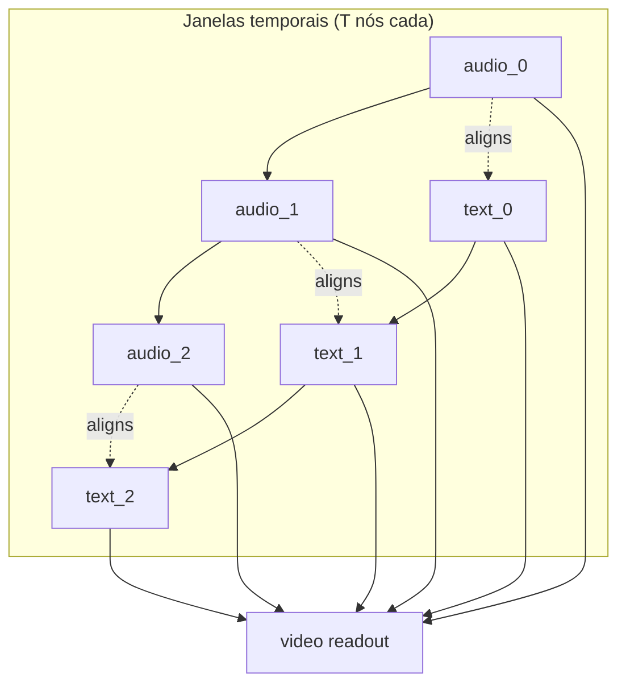

# Procedimento de treinamento — GNN heterogêneo (gnn-modalblocks)

Este documento descreve a abordagem **GNN heterogêneo** para o **ABAW 11th AH Video
Recognition Challenge**, implementada com a biblioteca
[`gnn-modalblocks`](/home/rwp/code/project_lib/gnn-modalblocks) e o pipeline de
dados da branch `origin/luiz`.

## 1. Objetivo

Classificação **binária em nível de vídeo**: prever se um vídeo contém
Ambivalência/Hesitação (A/H) — label `1` — ou não — label `0`.

Métrica oficial do challenge: **Macro F1** no test set privado (+ AP da classe positiva).

## 2. Relação com as branches de atenção

| Mecanismo (branches anteriores) | Equivalente no grafo GNN |
|--------------------------------|--------------------------|
| Local self-attention intra-modal (`matheus-local-attn`) | Arestas `temporal` entre janelas consecutivas (`audio→audio`, `text→text`) |
| Cross-attention áudio→texto (`luiz`, `matheus`) | Arestas `aligns` entre nós da mesma janela (`audio_i → text_i`) |
| Masked mean pool → logit de vídeo (`luiz`) | Nó `video` conectado a todas as janelas via `reports` + classificador no nó `video` |
| Features tabulares (usadas no RF, ignoradas na cross-attention) | Features iniciais do nó `video` (média tabular por janela) |

O **HeteroGAT** (`gnn_modalblocks.architectures.hetero_gat`) substitui camadas fixas
de atenção por **message passing aprendido** sobre essa topologia.

## 3. Topologia do grafo (por vídeo)



**Construção:** `src/data/graph_builder.py` → `build_video_hetero_graph()`.

- Entrada: sequências `(T, d_audio)`, `(T, d_text)`, `(T, d_tab)` por vídeo.
- Saída: `torch_geometric.data.HeteroData`.
- Batching: `collate_graph_batch()` → `Batch.from_data_list`.

## 4. Modelo

Arquivo: `src/models/hetero_gnn.py`

1. **Encoder:** `ENCODERS.build("hetero_gat", ...)` da lib `gnn-modalblocks`.
   - 2 camadas `HeteroConv` + `GATConv`.
   - Arestas reversas adicionadas automaticamente (`hetero_utils`).
   - `head_node_type="video"` — predição no nó de leitura global.

2. **Refino:** MLP sobre logits derivados do nó `video` (BCEWithLogits).

3. **Lightning:** `LitHeteroGnn` — mesmas métricas (Macro F1, AP) do caminho
   cross-attention.

Registro: `hetero_gnn` em `src/models/registry.py` (import lazy, family=`lightning`).

## 5. Pipeline de dados (reutilizado de `origin/luiz`)

O GNN consome o **mesmo cache Parquet** que a cross-attention:

| Fase | Comando | Artefato |
|------|---------|----------|
| Pré-processamento | `uv run python main.py mode=preprocess` | `data/interim/windows.parquet`, áudio `.flac` |
| Featurização | `uv run python main.py mode=featurize device=cuda` | `data/processed/text_audio_windows.parquet` |
| Treino GNN | ver §6 | checkpoint em `outputs/` |

Cada linha do Parquet = **uma janela** com:
- `audio_emb`, `text_emb`, `tabular`
- `video_label` (alvo final)
- `split` (participant-wise)

Janelamento: 5 s de tamanho, hop 2,5 s (50% overlap) — ver `configs/data/default.yaml`.

## 6. Comandos de treinamento

### Instalação

```bash
# ffmpeg necessário para extração de áudio
uv sync --group neural
```

O grupo `neural` inclui `torch-geometric` e `gnn-modalblocks` (path editável em
`../project_lib/gnn-modalblocks`).

### Sequência completa

```bash
# 1) Índice + janelas + extração de áudio
uv run python main.py mode=preprocess

# 2) Embeddings (wav2vec2 + RoBERTa-emotion + tabular)
uv run python main.py mode=featurize device=cuda

# 3) Treino do GNN heterogêneo
uv run python main.py \
  +experiment=hetero_gnn \
  mode=train \
  device=cuda \
  wandb.mode=disabled

# 4) Avaliação no split de validação
uv run python main.py \
  +experiment=hetero_gnn \
  mode=evaluate \
  split=val \
  device=cuda \
  wandb.mode=disabled

# 5) Submissão no test set público
uv run python main.py \
  +experiment=hetero_gnn \
  mode=submit \
  split=test \
  device=cuda \
  wandb.mode=disabled
```

### Hiperparâmetros (`configs/model/hetero_gnn.yaml`)

| Parâmetro | Default | Descrição |
|-----------|---------|-----------|
| `hidden_channels` | 128 | Dimensão oculta do GAT |
| `heads` | 4 | Cabeças de atenção |
| `out_channels` | 64 | Embedding por tipo de nó após conv |
| `dropout` | 0.1 | Dropout no refino |
| `lr` | 1e-3 | AdamW |
| `weight_decay` | 1e-2 | AdamW |

Overrides via CLI Hydra, por exemplo:

```bash
uv run python main.py +experiment=hetero_gnn model.heads=8 model.hidden_channels=256
```

## 7. Comparação com cross-attention

| Aspecto | Cross-attention (`luiz`) | GNN heterogêneo |
|---------|--------------------------|-----------------|
| Fusão cross-modal | `MultiheadAttention(q=audio, kv=text)` | Arestas `aligns` + GAT |
| Contexto temporal | Atenção densa sobre T (com mask) | Arestas `temporal` locais + multi-hop GAT |
| Readout | Mean pool mascarado | Nó `video` + MLP |
| Tabular | Ignorado | Nó `video` (média por janela) |
| Lib | PyTorch nativo | `gnn-modalblocks` + PyG |

## 8. Arquivos relevantes

```
src/data/graph_builder.py      # topologia HeteroData + collate
src/models/hetero_gnn.py       # HeteroGAT + Lightning
src/models/registry.py         # registro hetero_gnn
configs/model/hetero_gnn.yaml
configs/experiment/hetero_gnn.yaml
main.py                        # collate graph quando model.name=hetero_gnn
```

## 9. Referências

- BAH dataset: `data/raw/readme.md`
- Challenge: https://affective-behavior-analysis-in-the-wild.github.io/11th/
- gnn-modalblocks: `/home/rwp/code/project_lib/gnn-modalblocks/README.md`
- Paper BAH: https://arxiv.org/pdf/2505.19328
