# Procedimento de treinamento — GNN heterogêneo (gnn-modalblocks)

Este documento descreve a abordagem **GNN heterogêneo** para o **ABAW 11th AH Video
Recognition Challenge**, implementada com a biblioteca
[`gnn-modalblocks`](/home/rwp/code/project_lib/gnn-modalblocks) e o pipeline de
dados da branch `origin/luiz`.

> **Produção atual (test Macro-F1 0.7454):** ensemble **meta-router CA ⊕ GNN** —
> fluxogramas, matriz de confusão, ROC/PR, MCC e como reproduzir em
> [`meta_router_ca_gnn.md`](meta_router_ca_gnn.md).

## 1. Objetivo

Classificação **binária em nível de vídeo**: prever se um vídeo contém
Ambivalência/Hesitação (A/H) — label `1` — ou não — label `0`.

Métrica oficial do challenge: **Macro F1** no test set privado (+ AP da classe positiva).

## 2. Relação com as branches de atenção

| Mecanismo (branches anteriores) | Equivalente no grafo GNN |
|--------------------------------|--------------------------|
| Local self-attention intra-modal (`matheus-local-attn`) | Arestas `temporal` entre janelas consecutivas (`audio→audio`, `text→text`) |
| Cross-attention áudio→texto (`luiz`, `matheus`) | Arestas `aligns` entre nós da mesma janela (`audio_i → text_i`) |
| Masked mean pool → logit de vídeo (`luiz`) | Nó `video` conectado a todas as janelas via `reports` + classificador no nó `video` |
| Features tabulares (usadas no RF, ignoradas na cross-attention) | Features iniciais do nó `video` (média tabular por janela) |

O **HeteroGAT** (`gnn_modalblocks.architectures.hetero_gat`) substitui camadas fixas
de atenção por **message passing aprendido** sobre essa topologia.

## Modelos GNN

| Modelo | Comando Hydra | Descrição |
|--------|---------------|-----------|
| **`gnn_baseline`** (default do preset) | `model=gnn_baseline` | MultimodalBlock + LatentCorrelationGCN — espelha cross-attention |
| **`hetero_gnn`** (avançado) | `model=hetero_gnn` | HeteroGAT com grafo áudio/texto/vídeo |
| **`hetero_gnn_contrastive`** | `model=hetero_gnn_contrastive` | HeteroGAT + BCE + SupCon (+ triplet opcional) |
| **`multimodal_hetero_full`** (competição) | `+experiment=multimodal_hetero_full` | Stack completo: MultimodalBlock → HetGAT (grafo fused) → LatentGCN → BiLSTM + contrastive multi-task |
| **`multimodal_hetero_face`** (competição + face) | `+experiment=multimodal_hetero_face` | Stack acima + **Face Mesh 468 pts** com GCN espacial (arestas por distância) + GCN temporal (GNN4TS-style) |

## 3. Arquiteturas de rede neural

Diagramas refletem o código em `src/models/` e `src/data/graph_builder.py`.
Dimensões entre parênteses vêm de `configs/model/*.yaml`.

> **Como ler os diagramas — código de cores por modalidade:**
>
> | Cor | Significado |
> |-----|-------------|
> | 🔵 azul | áudio |
> | 🟢 verde | texto |
> | 🟣 roxo | fusão áudio+texto (`fused`) |
> | 🟠 laranja | readout / nó `video` |
> | 🌸 rosa | face (visual) |
> | ⚪ cinza | saída (logit → probabilidade) |
> | 🟦 índigo | bloco interno (detalhe em 3.6) |
>
> Para reduzir ruído, os diagramas de modelo (3.2–3.4) mostram **só o forward-pass**.
> Os blocos internos estão em **3.6**; as perdas de treino em **3.7**.

### 3.1 Visão geral (uma linha)

Independente do modelo, o fluxo é o mesmo: janelas → embeddings → encoder → 1 logit por vídeo.

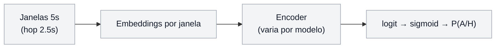

### 3.2 `hetero_gnn` — o modelo mais simples (comece por aqui)

Embeddings brutos viram um **grafo por vídeo**, o HeteroGAT propaga informação e o nó
`video` produz o logit.

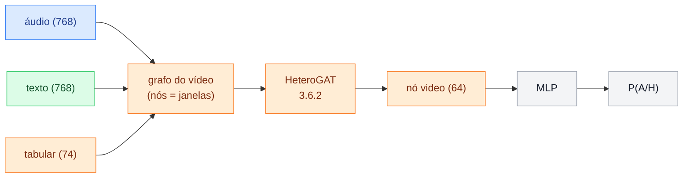

O que é o "grafo do vídeo" (3.5 detalha): cada janela é um nó; arestas ligam janelas
vizinhas no tempo, alinham áudio↔texto e reportam ao nó `video`.

Arquivos: `src/models/hetero_gnn.py`, `src/models/hetero_gnn_contrastive.py`.

### 3.3 `multimodal_hetero_full` — 3 ramos em paralelo

A ideia central: fundir áudio+texto uma vez (`fused`) e olhar esse sinal por **3 lentes
complementares**, depois concatenar.

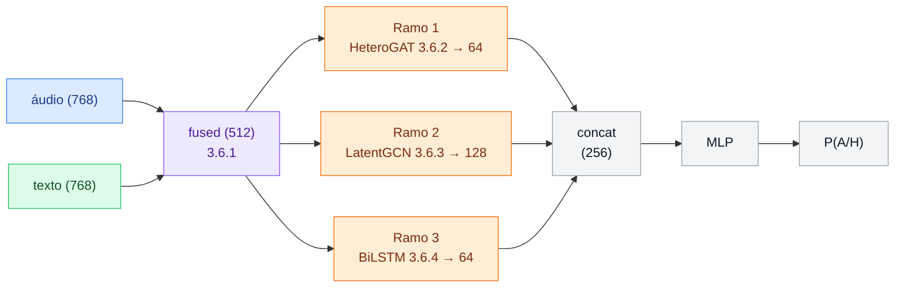

**Para que serve cada ramo:**

| Ramo | Captura | Saída | Zoom interno |
|------|---------|-------|--------------|
| HeteroGAT | relações no grafo (temporal + cross-modal) | 64 | 3.6.2 |
| LatentGCN | correlações latentes entre janelas | 128 | 3.6.3 |
| BiLSTM | ordem temporal densa | 64 | 3.6.4 |
| **concat** | | **256** | |

O `fused` vem do **MultimodalBlock** (3.6.1).

Arquivo: `src/models/multimodal_hetero_full.py`.

### 3.4 `multimodal_hetero_face` — o `full` + 1 ramo visual

Reusa **todo** o `full` (256-d) e soma um 4º ramo de face (128-d) antes do MLP.

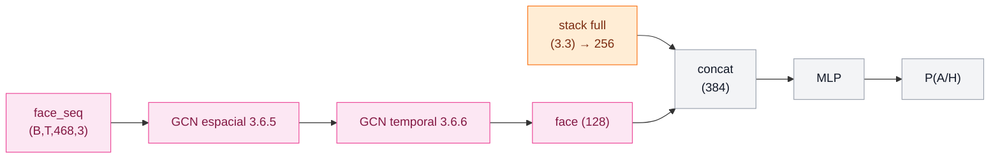

Arquivo: `src/models/multimodal_hetero_face.py`, `src/models/face_gcn_ts.py`.

O ramo face abre em dois blocos: **GCN espacial** (3.6.5) e **GCN temporal** (3.6.6).

### 3.5 Zoom: o grafo heterogêneo de um vídeo

Só para entender o "grafo do vídeo" da 3.2/3.3. Cada janela `t` é um nó; três tipos de aresta:

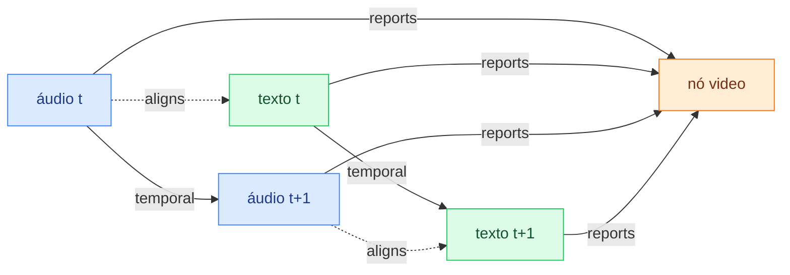

| Aresta | Papel | Equivalente clássico |
|--------|-------|----------------------|
| `temporal` | liga janelas vizinhas | self-attention local |
| `aligns` | liga áudio↔texto da mesma janela | cross-attention |
| `reports` | toda janela → nó `video` | mean pool + classificador |

No `multimodal_hetero_full` há ainda o nó `fused` com as mesmas arestas
(`src/data/graph_builder.py`, `BAH_FULL_GRAPH_METADATA`).

### 3.6 Zoom: blocos internos

Cada caixa dos diagramas 3.2–3.4 corresponde a um módulo concreto. Abaixo, o
**forward interno** de cada bloco (sem losses).

#### 3.6.1 MultimodalBlock — fusão áudio + texto

Gera o tensor `fused (512)` usado pelos 3 ramos do `full`. Config: `fusion: attention`.

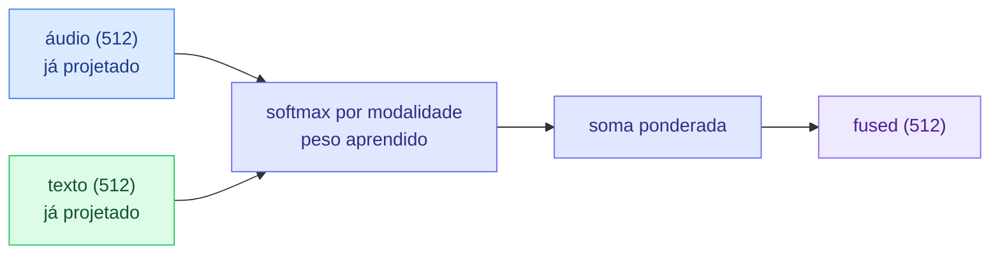

| Etapa | O que faz |
|-------|-----------|
| Projeção | `Linear(768→512)` em áudio e texto (antes do block, em `multimodal_hetero_full`) |
| AttentionFusion | empilha modalidades, calcula peso `softmax(Linear(x))` por janela |
| Saída | embedding fundido `fused` por janela temporal |

Arquivo: `gnn-modalblocks/fusion/multimodal_block.py`, `fusion/attention.py`.

#### 3.6.2 HeteroGAT — message passing no grafo

`num_layers` camadas de `HeteroConv` + `GATConv` (config: `model.gat_num_layers`, default **2**).
Não houve sweep sistemático de profundidade — o default 2 é o histórico da lib `gnn-modalblocks`.
Camadas intermediárias: hidden→hidden (multi-head); última: hidden→`out_channels` (1 head).

Sweep sugerido:

```bash
uv run python main.py -m +experiment=hetero_gnn_v2 mode=train \
  model.gat_num_layers=2,3,4 device=cuda wandb.mode=disabled
```

Arquivo: `gnn-modalblocks/architectures/hetero_gat.py` (`num_layers` configurável desde audit-004).

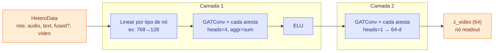

| Etapa | Dimensões (default) | Papel |
|-------|---------------------|-------|
| Projeção | por tipo de nó → 128 | alinha dimensões antes do GAT |
| GAT camada 1 | 128 → 128 (4 heads) | propaga entre janelas e modalidades |
| GAT camada 2 | 128 → 64 | embedding final do nó `video` |

No `hetero_gnn`, `z_video` passa por um MLP externo (`refine`). No `full`, entra no `concat`.

Arquivo: `gnn-modalblocks/architectures/hetero_gat.py`.

#### 3.6.3 LatentGCN — adjacência aprendida entre janelas

Cada janela `fused` é um nó; o grafo **não é fixo** — a adjacência vem de atenção Q·K com sparsificação top-k.

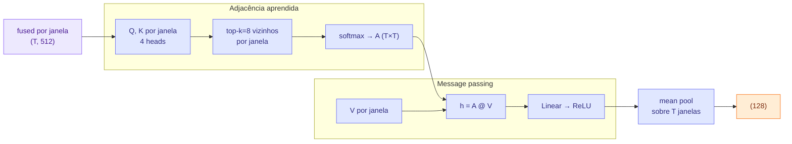

| Etapa | O que faz |
|-------|-----------|
| Atenção Q·K | score entre pares de janelas (correlação latente) |
| top-k | mantém só os 8 vizinhos mais relevantes (grafo esparso) |
| A @ V | GCN clássico sobre adjacência aprendida |
| mean pool | 1 vetor por vídeo |

Arquivo: `gnn-modalblocks/architectures/latent_gcn.py` (`LatentCorrelationGCN`).

#### 3.6.4 TemporalEncoder — BiLSTM sobre `fused`

Captura ordem temporal **densa** (complementar ao grafo esparso do LatentGCN).

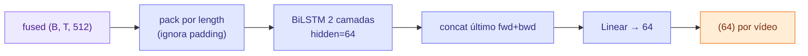

Arquivo: `gnn-modalblocks/architectures/temporal_encoder.py`.

#### 3.6.5 Face Spatial GCN — grafo dos 468 landmarks (por janela)

Uma janela de vídeo → 468 nós (keypoints MediaPipe). Arestas k-NN por distância euclidiana.

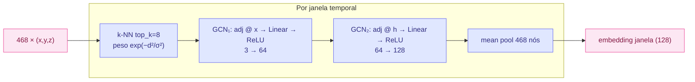

Arquivos: `src/models/face_gcn_ts.py` (`DistanceGCNLayer`), `src/data/face_graph.py`.

#### 3.6.6 Face Temporal GCN — cadeia entre janelas

Modo default `chain`: embeddings espaciais de cada janela ligados em cadeia `t ↔ t+1`.

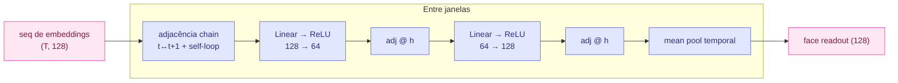

Modo alternativo `gnn4ts`: o GCN temporal roda **por landmark** (`468 × T`) em vez de
pool espacial antes — ver `FaceLandmarkTemporalGCN` em `face_gcn_ts.py`.

#### 3.6.7 Mapa: onde cada bloco aparece

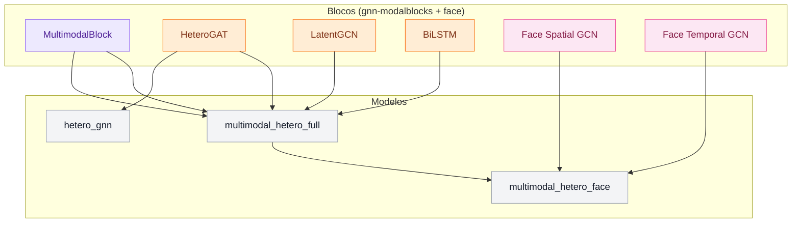

### 3.7 Perdas de treino (fora do forward-pass)

Todos treinam com BCE; os modelos "contrastive/full" somam termos auxiliares sobre o embedding.

| Perda | Onde se aplica | Modelos |
|-------|----------------|---------|
| BCE / Focal | logit final | todos |
| SupCon (λ≈0.1) | `video_emb` | contrastive, full, face |
| NT-Xent (λ≈0.05) | pares áudio↔texto | full, face |
| Triplet (λ≈0.05) | `video_emb` (miner batch-hard) | opcional |

### 3.8 Ensemble de inferência (produção)

**Stack atual recomendado:** meta-router CA (7 seeds librosa) ⊕ HeteroGAT wav2vec2 —
doc completo com fluxogramas e plots em [`meta_router_ca_gnn.md`](meta_router_ca_gnn.md)
(`scripts/meta_router_ca_gnn.py`, test F1 **0.7454**).

Ensemble GNN legado (3 membros, média ponderada; test F1 ~0.684):

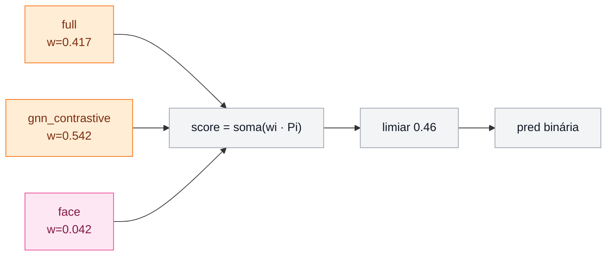

Otimização offline dos pesos legados: `scripts/ensemble_sweep.py` → `configs/ensemble/optimized.yaml`.

## Face Mesh + GCN temporal (GNN4TS-style)

Pipeline visual opcional para A/H (expressão facial):

1. **`mode=featurize_face`** — MediaPipe Face Mesh extrai **468 landmarks** `(x,y,z)` por janela
   temporal, alinhados a `[t0, t1]` do mp4. Grava coluna `face_landmarks` no Parquet.
2. **Grafo espacial (por janela)** — 468 nós; arestas k-NN ponderadas por
   `exp(-d²/σ²)` entre distâncias euclidianas entre keypoints (`src/data/face_graph.py`).
3. **Grafo temporal (por vídeo)** — sequência de embeddings de janela conectada em cadeia
   `t→t+1` (`src/models/face_gcn_ts.py`), análogo a grafos que variam no tempo (GNN4TS).
4. **Modelo** — `multimodal_hetero_face` concatena o readout facial ao stack HetGAT+LatentGCN+BiLSTM.

```bash
# deps visuais (MediaPipe + OpenCV)
uv sync --group neural --group vision

# 1) featurize áudio+texto (já existente)
uv run python main.py mode=featurize device=cuda

# 2) adicionar face landmarks ao Parquet
uv run python main.py mode=featurize_face +face_embedder=mediapipe

# 3) treinar
uv run python main.py +experiment=multimodal_hetero_face mode=train device=cuda wandb.mode=disabled
```

Requer `data/raw/Videos/**/*.mp4` (mesmos paths do índice).

## Logging de experimentos

O treino neural usa **Weights & Biases** (`wandb`, config `wandb.mode`) — **não** MLflow local.
Checkpoints e métricas ficam em `outputs/<experiment_name>/...` (`.ckpt` + `trainer_state.json`).

Para desligar W&B: `wandb.mode=disabled`.

A lib `gnn-modalblocks` tem callback MLflow; integração futura se necessário.

**Construção do grafo:** `src/data/graph_builder.py` → `build_video_hetero_graph()`.

- Entrada: sequências `(T, d_audio)`, `(T, d_text)`, `(T, d_tab)` por vídeo.
- Saída: `torch_geometric.data.HeteroData`.
- Batching: `collate_graph_batch()` → `Batch.from_data_list`.
- Topologia do grafo: ver **3.5**; blocos internos: **3.6**.

## 4. Modelo

Arquivo: `src/models/hetero_gnn.py`

1. **Encoder:** `ENCODERS.build("hetero_gat", ...)` da lib `gnn-modalblocks`.
   - 2 camadas `HeteroConv` + `GATConv`.
   - Arestas reversas adicionadas automaticamente (`hetero_utils`).
   - `head_node_type="video"` — predição no nó de leitura global.

2. **Refino:** MLP sobre logits derivados do nó `video` (BCEWithLogits).

3. **Lightning:** `LitHeteroGnn` — mesmas métricas (Macro F1, AP) do caminho
   cross-attention.

Registro: `hetero_gnn` em `src/models/registry.py` (import lazy, family=`lightning`).

## 5. Pipeline de dados (reutilizado de `origin/luiz`)

O GNN consome o **mesmo cache Parquet** que a cross-attention:

| Fase | Comando | Artefato |
|------|---------|----------|
| Pré-processamento | `uv run python main.py mode=preprocess` | `data/interim/windows.parquet`, áudio `.flac` |
| Featurização | `uv run python main.py mode=featurize device=cuda` | `data/processed/text_audio_windows.parquet` |
| Treino GNN | ver 6 | checkpoint em `outputs/` |

Cada linha do Parquet = **uma janela** com:
- `audio_emb`, `text_emb`, `tabular`
- `video_label` (alvo final)
- `split` (participant-wise)

Janelamento: 5 s de tamanho, hop 2,5 s (50% overlap) — ver `configs/data/default.yaml`.

## 6. Comandos de treinamento

### Instalação

```bash
# ffmpeg necessário para extração de áudio
uv sync --group neural
```

O grupo `neural` inclui `torch-geometric` e `gnn-modalblocks` (path editável em
`../project_lib/gnn-modalblocks`).

### Memória (RTX 3060 12 GB ou RAM limitada)

O featurize processa **256 janelas por vez** (`data.featurize_chunk_size`) para não
carregar ~15k waveforms na RAM de uma vez. Se ainda travar:

```bash
uv run python main.py +experiment=hetero_gnn mode=featurize device=cuda \
  data.featurize_chunk_size=128 \
  audio_embedder.batch_size=2 \
  text_embedder.batch_size=4
```

Evite rodar `mode=featurize` **sem** `+experiment=hetero_gnn` — o default usa
**librosa na CPU** (lento e pesado em todas as threads).

### Sequência completa

```bash
# 1) Índice + janelas + extração de áudio
uv run python main.py mode=preprocess

# 2) Embeddings (wav2vec2 + RoBERTa-emotion + tabular)
uv run python main.py mode=featurize device=cuda

# 3) Treino do GNN heterogêneo
uv run python main.py \
  +experiment=hetero_gnn \
  mode=train \
  device=cuda \
  wandb.mode=disabled

# 4) Avaliação no split de validação
uv run python main.py \
  +experiment=hetero_gnn \
  mode=evaluate \
  split=val \
  device=cuda \
  wandb.mode=disabled

# 5) Submissão no test set público
uv run python main.py \
  +experiment=hetero_gnn \
  mode=submit \
  split=test \
  device=cuda \
  wandb.mode=disabled
```

### Hiperparâmetros (`configs/model/hetero_gnn.yaml`)

| Parâmetro | Default | Descrição |
|-----------|---------|-----------|
| `gat_num_layers` | 2 | Camadas HeteroConv+GAT (`model.gat_num_layers`) |
| `lstm_num_layers` | 2 | Camadas BiLSTM no `multimodal_hetero_full` |
| `hidden_channels` | 128 | Dimensão oculta do GAT |
| `heads` | 4 | Cabeças de atenção |
| `out_channels` | 64 | Embedding por tipo de nó após conv |
| `dropout` | 0.1 | Dropout no refino |
| `lr` | 1e-3 | AdamW |
| `weight_decay` | 1e-2 | AdamW |

Overrides via CLI Hydra, por exemplo:

```bash
uv run python main.py +experiment=hetero_gnn model.heads=8 model.hidden_channels=256
```

## 7. Comparação com cross-attention

| Aspecto | Cross-attention (`luiz`) | GNN heterogêneo |
|---------|--------------------------|-----------------|
| Fusão cross-modal | `MultiheadAttention(q=audio, kv=text)` | Arestas `aligns` + GAT |
| Contexto temporal | Atenção densa sobre T (com mask) | Arestas `temporal` locais + multi-hop GAT |
| Readout | Mean pool mascarado | Nó `video` + MLP |
| Tabular | Ignorado | Nó `video` (média por janela) |
| Lib | PyTorch nativo | `gnn-modalblocks` + PyG |

## 8. Arquivos relevantes

```
src/data/graph_builder.py      # topologia HeteroData + collate
src/models/hetero_gnn.py       # HeteroGAT + Lightning (+ focal/label-smooth)
src/models/hetero_gnn_contrastive.py
src/models/lightning_utils.py  # focal, cosine_warmup, SWA hooks
src/models/registry.py
configs/model/hetero_gnn_contrastive.yaml
configs/experiment/hetero_gnn_v2.yaml
configs/experiment/hetero_gnn_v2_tuned.yaml
configs/experiment/hetero_gnn_v2_ablation.yaml
configs/ensemble/hybrid_catboost_gnn_v2.yaml
configs/ensemble/hybrid_full.yaml
scripts/ensemble_sweep.py
scripts/meta_router_ca_gnn.py  # produção CA⊕GNN (ver meta_router_ca_gnn.md)
scripts/gated_ensemble.py
main.py                        # ensemble sklearn+lightning, evaluate/submit
references/meta_router_ca_gnn.md
```

## 9. Pipeline completa (parquet d_tab=74)

### Blocos de suporte (branch `luiz`)

Dois blocos de **late fusion** entram na coluna `tabular` do parquet (não no embedding):

| Bloco | Módulo | dim | Doc |
|-------|--------|-----|-----|
| Hesitação acústica | `HesitationExtractor` | 18 | [`HESITATION.md`](../src/features/HESITATION.md) |
| Ambivalência/hesitação textual | `TextFeaturizer` | 49 | [`TEXT_FEATURES.md`](../src/features/TEXT_FEATURES.md) |
| question_type one-hot | `TabularFeaturizer` | 7 | — |
| **Total `d_tab`** | | **74** | (era 17 sem suporte) |

Config: `data.tabular.use_hesitation=true` + `use_text_features=true` (já em `configs/data/default.yaml`).
Preset unificado: `+experiment=luiz_support_features`. Calibração luiz: `aggregation.calibration=base_rate`.

### Reprodução cross-attention Luiz (ensemble 7 seeds)

Preset fiel: `+experiment=cross_attention_luiz_repro` — `monitor=val_ap`, `patience=20`,
`tab_fusion=token`, `pool=attention`, `dropout=0.3`, `wd=0.05`, `lr=3e-4`, `d_tab=74`.

| Etapa | Calibração | Notas |
|-------|------------|-------|
| Treino single-seed | `base_rate` | Early stop em `val_ap` |
| Ensemble evaluate | `smooth` | Como `ENS_CALIB=smooth` no Makefile luiz |

```bash
# Pipeline completo (7 seeds + ensemble test)
make luiz-repro DEVICE=cuda

# Ou passo a passo
make train-luiz-ensemble DEVICE=cuda          # SEEDS=42 1 2 3 4 5 6
make eval-luiz-ensemble DEVICE=cuda SPLIT=test LUIZ_ENS_CALIB=smooth

# Script equivalente
uv run python scripts/luiz_cross_attention_repro.py all --device cuda
```

Manifest: `outputs/cross_attention/luiz_ensemble_manifest.txt` →
`configs/ensemble/cross_attention_luiz_seeds.yaml` (gerado).

**Resultado local (Jul/13):**

| Áudio | Ensemble test F1 | vs Luiz 0.7245 |
|-------|------------------|----------------|
| wav2vec2 | 0.7059 | −0.019 |
| **librosa** | **0.7240** | **≈ match** |

Parquet librosa: `data/processed/text_audio_windows_librosa.parquet` (`d_audio=320`, `d_tab=74`).
Manifest librosa: `outputs/cross_attention/luiz_ensemble_manifest_librosa.txt`.

```bash
# Librosa (recomendado — reproduz o F1 do Luiz)
make luiz-repro-librosa DEVICE=cuda FORCE_FEAT=1   # 1ª vez: refeaturiza
make luiz-repro-librosa DEVICE=cuda                # depois: só treina ensemble

uv run python scripts/luiz_cross_attention_repro.py all --audio librosa \
  --force-featurize --device cuda
```

Single-seed wav2vec2 repro: `outputs/cross_attention/20260713_172626` → test **0.7000**.

### HeteroGAT + parquet librosa

Preset: `+experiment=hetero_gnn_v2_librosa` — usa `text_audio_windows_librosa.parquet`
e **`common_dim: 512`** (projeta áudio 320-d e texto 768-d antes do GAT; evita domínio do texto).

| Variante | Test F1 | Checkpoint |
|----------|---------|------------|
| tab_enhanced + SupCon + common_dim | **0.6697** | `outputs/hetero_gnn_contrastive/20260713_181101` |
| tab no grafo (sem enhanced) | 0.501 | — |
| sem common_dim | 0.495 | — |

O GNN **não** iguala cross-attention com librosa (0.724): message-passing beneficia menos
do tabular do que a fusão token+MIL. Melhor GNN absoluto continua **wav2vec2**
(`hetero_gnn_v2_tune_wav2vec2` **0.7109**).

`hetero_gnn_v2_tune` atual = **librosa + CA edge weights** (`use_ca_edge_weights`):
atenção áudio→texto como `aligns` densos (T×T) e MIL token-tab como `reports`
janela→vídeo (`HeteroGATEdgeAttr` + `ca_scorer`). Test **0.691** — acima do GNN
librosa naive (0.67), abaixo do wav2vec2 e do CA.

```bash
uv run python main.py +experiment=hetero_gnn_v2_tune mode=train device=cuda
# legado wav2vec2 (0.7109):
uv run python main.py +experiment=hetero_gnn_v2_tune_wav2vec2 mode=train device=cuda
```

### Ensemble de seeds GNN + stacking CA⊕GNN (Jul/13)

```bash
# 7 seeds do melhor preset GNN (wav2vec2)
make gnn-ensemble DEVICE=cuda                    # GNN_EXPERIMENT=hetero_gnn_v2_tune
make gnn-ensemble GNN_EXPERIMENT=hetero_gnn_v2_luiz_mil DEVICE=cuda

# Weight sweep: média dos 7 CA-librosa ⊕ better GNN single (parquets distintos)
uv run python scripts/export_and_sweep.py \
  --member ca:+experiment=cross_attention_luiz_librosa:<ckpt> \
  --member gnn:+experiment=hetero_gnn_v2_tune:outputs/hetero_gnn_contrastive/20260713_162753 \
  --group-mean ca --device cuda --out outputs/ensemble_eval/ca_librosa_gnn_sweep.json
```

**Resultados:** GNN 7-seed ensemble **0.687** (pior que single 0.7109 — seeds novas
cairam vs checkpoint histórico). Tab MIL Luiz (`hetero_gnn_v2_luiz_mil`) **0.669**.
Stacking CA⊕GNN mean → test **0.716** — **abaixo** do CA librosa sozinha (**0.724**).

### Hard mining vs miner vs dataset (CA⊕GNN)

Dois mecanismos **desconectados**:

| Mecanismo | O quê | Onde |
|-----------|--------|------|
| **Hard mining** (`mode=hard_mining` / `mine_hard_from_preds.py`) | Oversample vídeos hard pos/neg via `WeightedRandomSampler` | `data.hard_examples` JSON |
| **Miner `batch_hard`** | Triplet no **batch** (pos longe, neg perto no embedding) | só se `lambda_triplet>0` |

No GNN de produção `lambda_triplet=0` → o miner **não roda**; só SupCon.
Hard mining legado (`rare_mult=1.5` em neutral/willing) upweight ~40% do train e
dilui os ~18 hard reais — FT histórico piorou test.

Diagnóstico CA↔GNN no test: **both_ok 342 | ca_only 44 | gnn_only 42 | both_wrong 97**.
Oracle pick → **0.805**. Mean dilui; **qtype_soft** (pesos por `question_type` na val):

```bash
uv run python scripts/gated_ensemble.py --mode qtype_soft \
  --out outputs/ensemble_eval/gated_ca_gnn.json
# → test F1 **0.7255**

# Meta-router: pesos dos 7 seeds CA + swap GNN nas discordâncias (seleção conjunta na val)
uv run python scripts/meta_router_ca_gnn.py
# → test F1 **0.7454** (oracle ~0.80). Sem features de anotação.
# Doc + figuras: references/meta_router_ca_gnn.md

# Hard mine focado (sem rare) + FT GNN — NÃO melhorou o stack (0.7208):
uv run python scripts/mine_hard_from_preds.py \
  --ca-csv outputs/cross_attention/.../eval_train/predictions.csv \
  --gnn-csv outputs/hetero_gnn_contrastive/.../eval_train/predictions.csv \
  --out data/interim/hard_examples_ca.json
```

Os **97 both_wrong** com |pca−pgnn|≈0.09 mostram concordância no erro → problema de
**dataset/features** (qtypes `negative`/`positive`/`resistant`/`willing`), não de miner.

Features de suporte elevam `d_tab` de 17 → **74**. Checkpoints GNN
antigos (`dim_tab=32`) são **incompatíveis** — re-treinar obrigatório.

```bash
# 0) Deps (Praat + VADER para hesitation/text)
uv sync --group neural

# 1) Featurize (wav2vec2 + RoBERTa + hesitation + text_features)
uv run python main.py +experiment=featurize_deep mode=featurize device=cuda +data.force=true

# 2) CatBoost tabular (melhor sklearn + base_rate)
uv run python main.py +experiment=catboost_baseline mode=train aggregation.calibration=base_rate

# 3) GNN contrastive (usa tab_seq com d_tab=74 no grafo heterogêneo)
uv run python main.py +experiment=hetero_gnn_v2 mode=train device=cuda

# 4) Avaliar / submeter
uv run python main.py +experiment=hetero_gnn_v2 mode=evaluate split=test \
  checkpoint=outputs/hetero_gnn_contrastive/<run> device=cuda
```

### Leaderboard atual (test público, 525 vídeos)

| Run | Preset | Val F1 | **Test F1** | Checkpoint |
|-----|--------|--------|-------------|------------|
| **CA⊕GNN meta-router (joint val)** | [`meta_router_ca_gnn.md`](meta_router_ca_gnn.md) | 0.724 | **0.7454** | `outputs/ensemble_eval/meta_router_ca_gnn.json` |
| **CA⊕GNN qtype_soft (val-calibrated)** | `scripts/gated_ensemble.py` | 0.726 | **0.7255** | `outputs/ensemble_eval/gated_ca_gnn.json` |
| **Cross-attention Luiz librosa ensemble** | `cross_attention_luiz_librosa` + smooth | 0.687 | **0.7240** | manifest `luiz_ensemble_manifest_librosa.txt` |
| **hetero_gnn_v2_tune_wav2vec2** | `hetero_gnn_v2_tune_wav2vec2` | — | **0.7109** | `outputs/hetero_gnn_contrastive/20260713_162753` |
| hetero_gnn_v2_tune (librosa + CA edges) | `hetero_gnn_v2_tune` + smooth | 0.701 | **0.6911** | `outputs/hetero_gnn_contrastive/20260713_185115` |
| CA librosa ⊕ GNN tune (sweep val) | `export_and_sweep.py` ~0.73/0.27 | 0.701 | 0.7156 | `outputs/ensemble_eval/ca_librosa_gnn_sweep.json` |
| hetero_gnn_v2_tune 7-seed ensemble | `gnn_seed_ensemble.py` | — | 0.6873 | manifest `hetero_gnn_v2_tune_manifest.txt` |
| hetero_gnn_v2_luiz_mil (tab MIL) | `hetero_gnn_v2_luiz_mil` | 0.687 | 0.6694 | `outputs/hetero_gnn_contrastive/20260713_182333` |
| hetero_gnn_v2_librosa + common_dim | `hetero_gnn_v2_librosa` | 0.693 | 0.6697 | `outputs/hetero_gnn_contrastive/20260713_181101` |
| Cross-attention Luiz wav2vec2 ensemble (7 seeds) | `cross_attention_luiz_repro` + smooth | 0.682 | **0.7059** | manifest `luiz_ensemble_manifest.txt` |
| **hetero_gnn_v2** | `+experiment=hetero_gnn_v2` | 0.653 | **0.7046** | `outputs/hetero_gnn_contrastive/20260713_153143` |
| Cross-attention Luiz single | `cross_attention_luiz_repro` | — | 0.7000 | `outputs/cross_attention/20260713_172626` |
| CatBoost + suporte | `catboost_baseline` + `base_rate` | 0.612 | 0.7007 | `outputs/catboost/20260713_152213` |
| hetero_gnn_v2_tuned | focal+SWA+cosine+3 layers | 0.698 | 0.6691 | `outputs/hetero_gnn_contrastive/20260713_154500` |
| hetero_gnn_v2_ablation | 3 layers + focal leve | 0.663 | 0.6638 | `outputs/hetero_gnn_contrastive/20260713_154930` |
| Ensemble GNN antigo (3 membros) | `+ensemble=optimized` | 0.717 | 0.6843 | checkpoints Jul/06 |
| Híbrido CatBoost+GNN v2 | `+ensemble=hybrid_catboost_gnn_v2` | 0.654 | 0.6970 | — |

> **Melhor sistema (produção):** meta-router CA⊕GNN (**0.7454**) —
> [`meta_router_ca_gnn.md`](meta_router_ca_gnn.md).
> **Melhor GNN isolado histórico:** `hetero_gnn_v2_tune` wav2vec2 (**0.7109**).
> Tunings pesados (dropout 0.25, WD 0.05, SWA, cosine) melhoraram a val mas costumam
> **piorar** o teste (overfit).

## 10. Tuning de competição (`hetero_gnn_v2_*`)

Técnicas implementadas no código (opt-in via YAML):

| Técnica | Config | Quando usar |
|---------|--------|-------------|
| **Focal loss** | `model.loss.type=focal` | classes desbalanceadas, hard examples |
| **Label smoothing** | `model.loss.label_smoothing=0.02–0.05` | regularização leve |
| **Cosine + warmup** | `trainer.scheduler=cosine_warmup`, `warmup_epochs=8` | treinos longos |
| **SWA** | `trainer.swa=true`, `swa_epoch_start=200` | média de pesos no final |
| **Mais camadas GAT** | `model.gat_num_layers=3` | mais hops no grafo (cuidado com overfit) |
| **SupCon** | `model.contrastive.lambda_supcon` | embedding discriminativo |
| **Gradient accum** | `trainer.accumulate_grad_batches=2` | batch efetivo maior |
| **Calibração** | `aggregation.calibration=smooth` (GNN) / `base_rate` (CatBoost) | ver `aggregation.py` |

Presets:

- `+experiment=hetero_gnn_v2` — baseline que generalizou melhor (**usar este**)
- `+experiment=hetero_gnn_v2_tuned` — preset agressivo (val↑ test↓ neste dataset)
- `+experiment=hetero_gnn_v2_ablation` — meio-termo (3 layers + focal leve)

Sweep de profundidade:

```bash
uv run python main.py -m +experiment=hetero_gnn_v2 mode=train \
  model.gat_num_layers=2,3 device=cuda wandb.mode=disabled
```

### Optuna (HPO automático)

Script: `scripts/optuna_gnn_tune.py`. Otimiza **Macro-F1 na validação** (sem vazamento de teste);
ao final avalia o melhor trial no split `test` uma vez.

```bash
# deps (neural + optuna; vision só p/ face)
uv sync --group neural --group dev --group vision

# HeteroGAT contrastive (parquet atual)
uv run python scripts/optuna_gnn_tune.py --family hetero_gnn --n-trials 25 device=cuda \
  --storage sqlite:///outputs/optuna/hetero_gnn.db --study-name hetero_gnn_v1

# Face + landmarks (requer featurize_face antes — o script roda automaticamente)
uv run python scripts/optuna_gnn_tune.py --family hetero_face --n-trials 20 device=cuda \
  --storage sqlite:///outputs/optuna/hetero_face.db
```

Espaço de busca principal:

| Parâmetro | hetero_gnn | hetero_face (extra) |
|-----------|------------|---------------------|
| `gat_num_layers` | 2, 3 | idem |
| `hidden_channels` | 96, 128, 160 | idem |
| `lr`, `weight_decay`, `dropout` | log-uniform | idem |
| `loss.type` | bce, focal | idem |
| `contrastive.lambda_supcon` | 0–0.25 | idem |
| `face.temporal_mode` | — | chain, **gnn4ts** (espectral/temporal) |
| `face.use_velocity` | — | true/false (derivada dos landmarks) |
| `face.top_k`, `landmark_stride` | — | vizinhos espaciais + subsample |

Preset face: `+experiment=multimodal_hetero_face_v2` (`d_tab=74`).

Resultados: `outputs/optuna/<study>_best.json` + log em `outputs/optuna/hetero_gnn_run.log`.

## 11. Ensemble (produção)

**Atual:** CA Luiz librosa (7 seeds) + HeteroGAT + meta-router — ver
[`meta_router_ca_gnn.md`](meta_router_ca_gnn.md). Abaixo: ensemble GNN legado
(3 membros Lightning).

### Modelos no ensemble otimizado (legado)

| Modelo | Checkpoint | Peso |
|--------|------------|------|
| `multimodal_hetero_full` | `outputs/multimodal_hetero_full/20260706_213403` | 0.416667 |
| `hetero_gnn_contrastive` | `outputs/hetero_gnn_contrastive/20260706_211918` | 0.541667 |
| `multimodal_hetero_face` | `outputs/multimodal_hetero_face/20260712_141548` | 0.041667 |

Config: `configs/ensemble/optimized.yaml` (`combine: weighted`, limiar 0.46).

### Resultados (Macro-F1)

| Ensemble | Val F1 | Test F1 (público) |
|----------|--------|-------------------|
| antigo: full + gnn (média) | 0.7019 | 0.6692 |
| **novo: full + gnn + face (ponderado)** | **0.7169** | **0.6843** |

Evidência: `outputs/ensemble_eval/report_*.json` (baseline), `outputs/ensemble_eval/weight_sweep.json` (otimizado).

### Ensemble híbrido (CatBoost + GNN)

`configs/ensemble/hybrid_catboost_gnn_v2.yaml` — CatBoost + `hetero_gnn_v2` (parquet d_tab=74).
`configs/ensemble/hybrid_full.yaml` — inclui também `multimodal_hetero_full` e `face` (requer retreino).

```bash
uv run python main.py mode=ensemble_evaluate +ensemble=hybrid_catboost_gnn_v2 split=test \
  device=cuda aggregation.calibration=smooth
```

⚠️ Membros GNN antigos (`dim_tab=32`) falham no parquet novo. Re-treine com
`+experiment=hetero_gnn_v2` ou `multimodal_hetero_full` antes do ensemble completo.

### Ensemble GNN legado (Jul/06, d_tab=32)

```bash
# 1) Exportar predições de cada membro (val + test)
uv run python main.py +experiment=multimodal_hetero_full mode=evaluate split=val device=cuda
uv run python main.py +experiment=multimodal_hetero_full mode=evaluate split=test device=cuda
# (repetir para hetero_gnn_contrastive e multimodal_hetero_face)

# 2) Varredura de pesos offline (CPU, sem carregar modelos)
uv run python scripts/ensemble_sweep.py \
  --member full:outputs/.../eval_val/predictions.csv:outputs/.../eval_test/predictions.csv \
  --member gnn:outputs/.../eval_val/predictions.csv:outputs/.../eval_test/predictions.csv \
  --member face:outputs/.../eval_val/predictions.csv:outputs/.../eval_test/predictions.csv

# 3) Avaliar ensemble com config otimizada
uv run python main.py mode=ensemble_evaluate +ensemble=optimized split=val device=cuda

# 4) Gerar submissão (calibra limiar na val, infere no test)
uv run python main.py mode=ensemble_submit +ensemble=optimized device=cuda \
  data.num_workers=2 out=outputs/submission_ensemble_optimized.txt
```

Submissão gerada: `outputs/submission_ensemble_optimized.txt` (525 vídeos).

Baseline (média simples, 2 membros): `configs/ensemble/default.yaml` → `outputs/submission_ensemble.txt`.

## 12. Referências

- BAH dataset: `data/raw/readme.md`
- Challenge: https://affective-behavior-analysis-in-the-wild.github.io/11th/
- gnn-modalblocks: `/home/rwp/code/project_lib/gnn-modalblocks/README.md`
- Paper BAH: https://arxiv.org/pdf/2505.19328
- Auditoria / claims: `.specs/audits/claims.md`, `.specs/audits/DIGEST.md`
