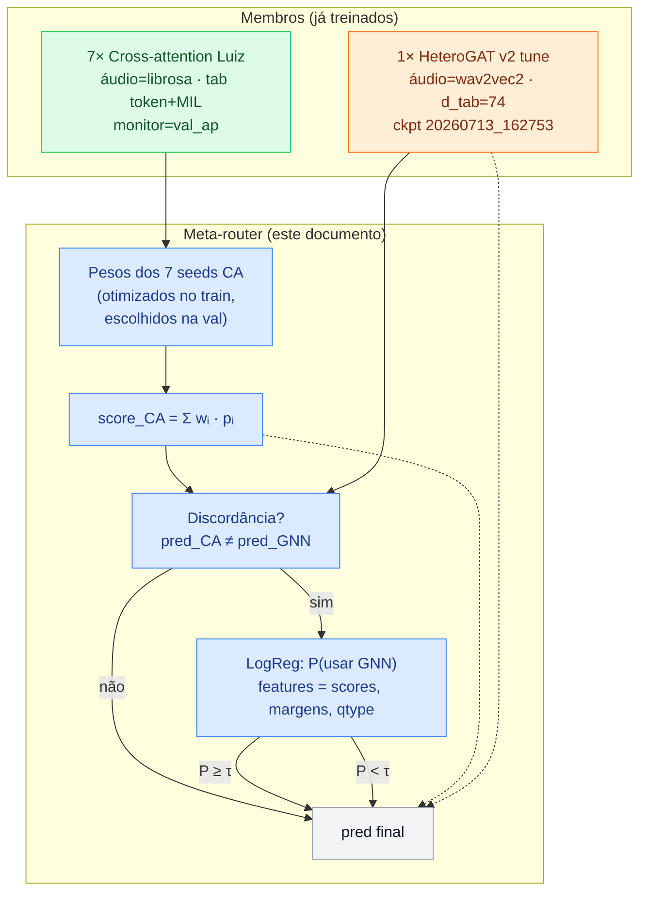
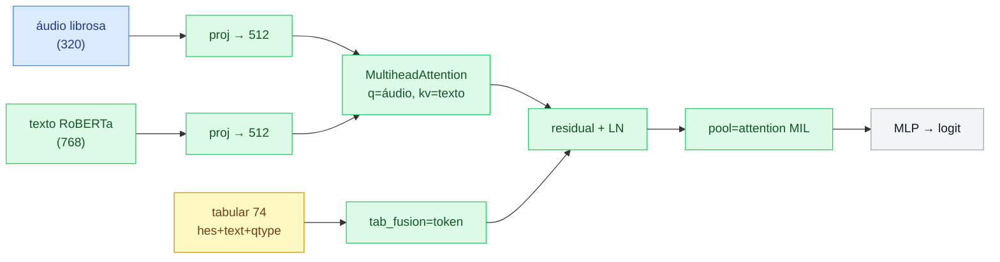
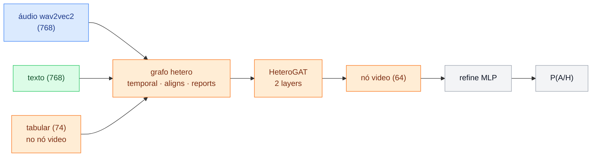
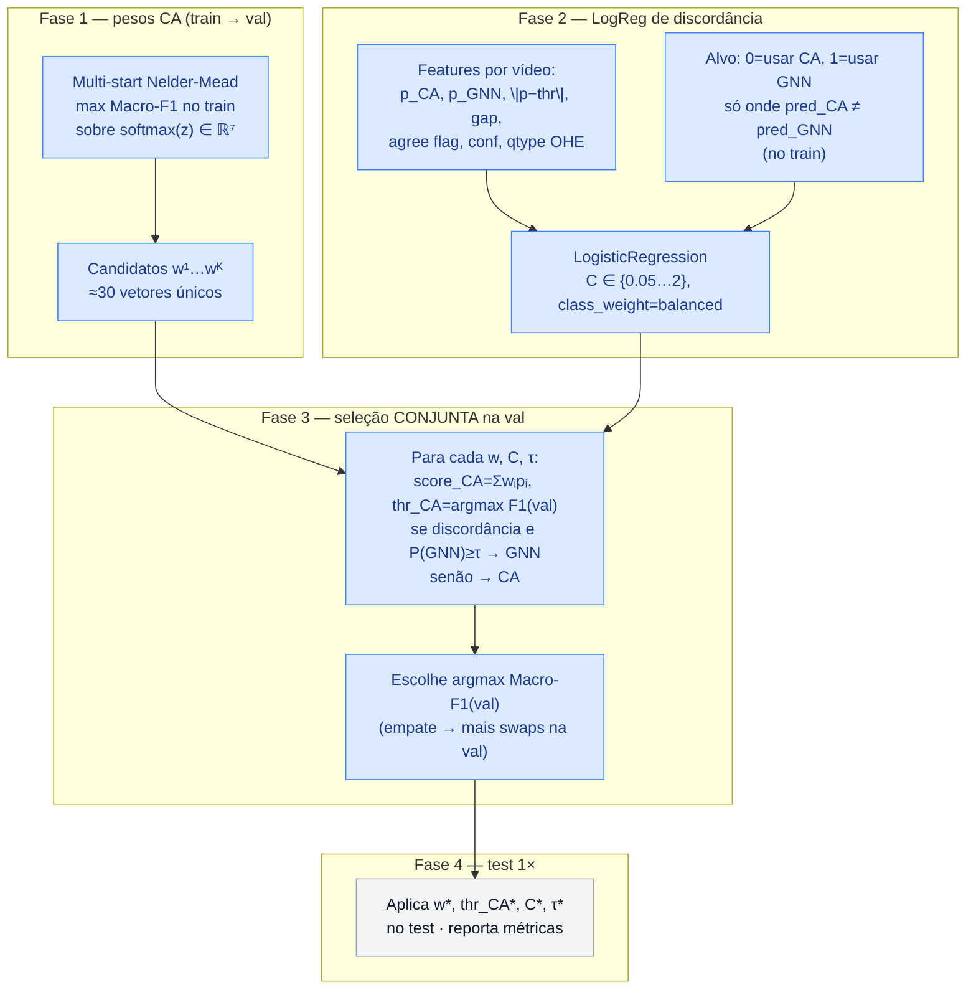
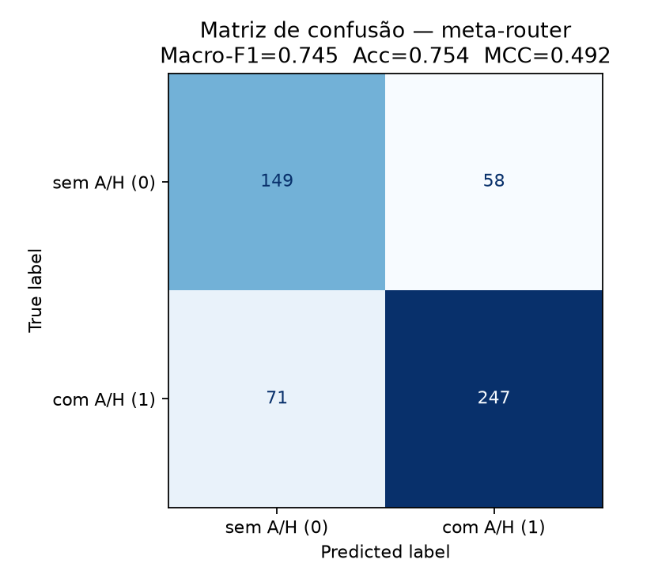
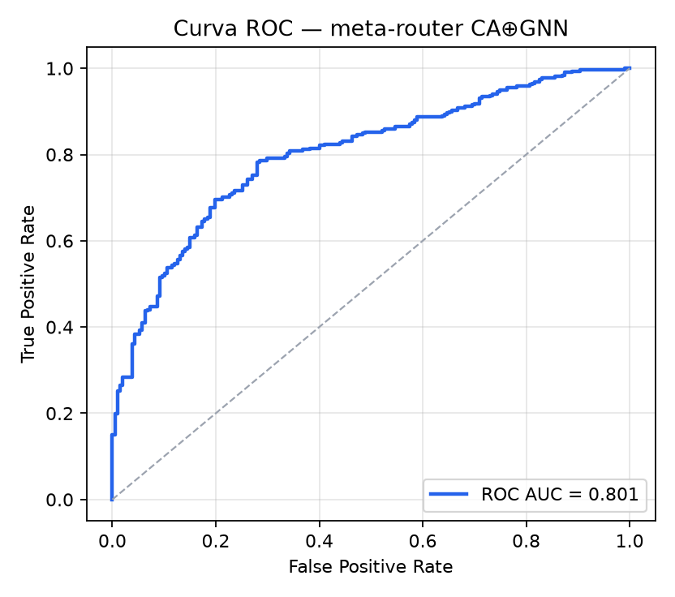
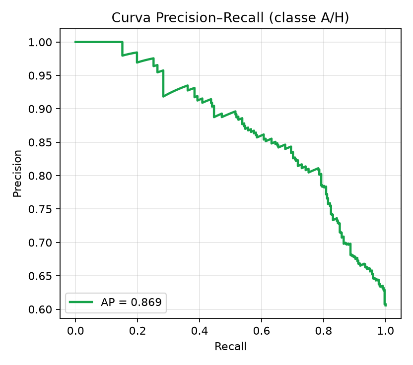
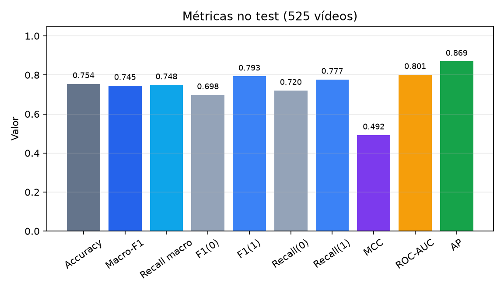
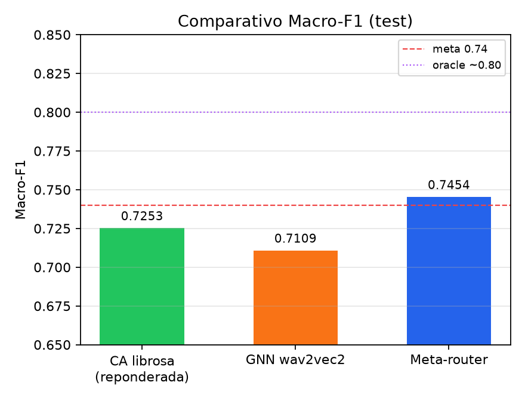
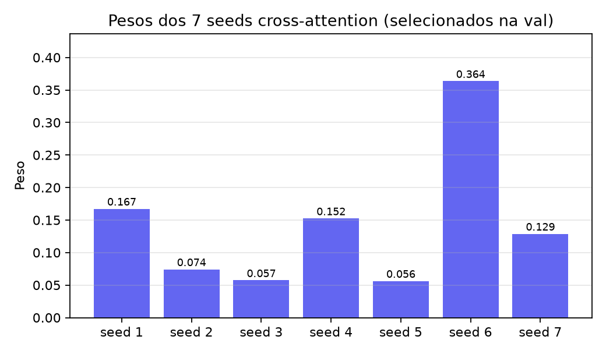

# Meta-router CA ⊕ GNN — documentação do ensemble

Ensemble de produção atual para o ABAW 11th AH Video Recognition Challenge:
**cross-attention Luiz (librosa, 7 seeds) + HeteroGAT wav2vec2**, com roteamento
aprendido e calibrado **somente na validação**.

| | |
|--|--|
| **Script** | [`scripts/meta_router_ca_gnn.py`](../scripts/meta_router_ca_gnn.py) |
| **Artefato** | [`outputs/ensemble_eval/meta_router_ca_gnn.json`](../outputs/ensemble_eval/meta_router_ca_gnn.json) |
| **Figuras** | [`references/figures/meta_router_ca_gnn/`](figures/meta_router_ca_gnn/) |
| **Macro-F1 (test)** | **0.7454** |
| **Pré-requisito** | preds dos 7 seeds CA + GNN `20260713_162753` em `eval_{train,val,test}` |

Relação com o GNN base: ver [`gnn_training_procedure.md`](gnn_training_procedure.md).

---

## 1. Motivação

Média ponderada CA⊕GNN **dilui** o melhor membro (CA librosa ≈ 0.724 → mean ≈ 0.716).
Há complementaridade real:

| Partição (test, thr fixos) | n |
|--|--|
| Ambos certos | ~342 |
| Só CA acerta | ~44 |
| Só GNN acerta | ~42 |
| Ambos erram | ~97 |

**Oracle pick** (sempre escolhe o modelo que acerta, se algum acertar) ≈ **0.80**.
Isso é teto teórico — não é um modelo deployável. O meta-router aproxima esse
roteamento com sinais disponíveis na inferência (scores, margens, `question_type`).

> **Não usar** `certainty_ah` / `ah_duration_s` nas features do roteador: vêm de
> anotações e **vazam o rótulo** (F1 artificial ~1.0).

---

## 2. Visão geral



Código de cores (mesmo padrão do guia GNN):

| Cor | Papel |
|-----|--------|
| 🟢 verde | ramo cross-attention (CA) |
| 🟠 laranja | ramo HeteroGAT |
| 🔵 azul | roteador / calibração |
| ⚪ cinza | saída |

---

## 3. Membros do ensemble

### 3.1 Cross-attention Luiz (librosa)



- Preset: `+experiment=cross_attention_luiz_librosa`
- Parquet: `data/processed/text_audio_windows_librosa.parquet`
- 7 seeds: `42, 1, 2, 3, 4, 5, 6` → runs em `outputs/cross_attention/20260713_1752*`
- Treino usa `aggregation.calibration=base_rate`; ensemble clássico usava `smooth`

### 3.2 HeteroGAT (`hetero_gnn_v2_tune` wav2vec2)



- Checkpoint: `outputs/hetero_gnn_contrastive/20260713_162753`
- Preset legado: `+experiment=hetero_gnn_v2_tune_wav2vec2` (o `hetero_gnn_v2_tune` atual aponta para librosa+CA-edges)
- Limiar salvo: `thr_gnn = 0.34`

---

## 4. Pipeline do roteador (detalhe)



### Hiperparâmetros selecionados (val)

| Símbolo | Valor | Papel |
|---------|-------|--------|
| `w` (7 seeds) | ≈ `[0.167, 0.074, 0.057, 0.152, 0.056, 0.364, 0.129]` | mistura dos seeds CA |
| `thr_ca` | **0.39** | limiar sobre `score_CA` |
| `thr_gnn` | **0.34** | limiar do checkpoint GNN |
| `C` | **1.0** | regularização do LogReg |
| `τ` | **0.425** | P(usar GNN) mínima para swap |

Na val: Macro-F1 roteador **0.724** (CA sozinha com esses pesos: 0.694) · **23 swaps**.  
No test: **47 swaps** em **89 discordâncias**.

---

## 5. Resultados no test (525 vídeos)

### 5.1 Tabela de métricas

| Métrica | Valor |
|---------|------:|
| **Macro-F1** | **0.7454** |
| Accuracy | 0.7543 |
| Recall macro | 0.7483 |
| F1 classe 0 (sem A/H) | 0.6979 |
| F1 classe 1 (com A/H) | 0.7929 |
| Recall classe 0 | 0.7198 |
| Recall classe 1 | 0.7767 |
| **Matthews (MCC)** | **0.4918** |
| ROC-AUC | 0.8011 |
| Average Precision | 0.8692 |

### 5.2 Matriz de confusão

|  | Pred 0 | Pred 1 |
|--|------:|------:|
| **True 0** (sem A/H, n=207) | **149** (TN) | 58 (FP) |
| **True 1** (com A/H, n=318) | 71 (FN) | **247** (TP) |



### 5.3 Curvas ROC e Precision–Recall





### 5.4 Barras de métricas e comparativo







### 5.5 Contexto vs baselines

| Sistema | Test Macro-F1 |
|---------|--------------:|
| CA librosa ensemble (mean + smooth) | 0.7240 |
| GNN wav2vec2 tune (single) | 0.7109 |
| Mean weighted CA⊕GNN | ~0.716 |
| qtype_soft gated | 0.7255 |
| **Meta-router (este doc)** | **0.7454** |
| Oracle pick (teto) | ~0.805 |

---

## 6. Como reproduzir

```bash
# 1) Garantir preds train/val/test dos 7 seeds CA + GNN
#    (já gerados se você rodou make luiz-repro-librosa + evaluate GNN)

# 2) Rodar seleção + avaliação test
uv run python scripts/meta_router_ca_gnn.py \
  --out outputs/ensemble_eval/meta_router_ca_gnn.json

# 3) Regenerar figuras (opcional; paths em references/figures/meta_router_ca_gnn/)
#    O JSON já traz a matriz e F1; plots podem ser refeitos a partir do script acima.
```

Entradas esperadas:

```
outputs/cross_attention/<seed>/eval_{train,val,test}/predictions.csv   # 7 seeds
outputs/hetero_gnn_contrastive/20260713_162753/eval_{train,val,test}/predictions.csv
outputs/hetero_gnn_contrastive/20260713_162753/trainer_state.json       # thr_gnn
```

---

## 7. O que o roteador **não** é

| Conceito | Relação |
|----------|---------|
| Hard mining (`WeightedRandomSampler`) | Amostragem de treino; **não** usado no meta-router |
| Miner `batch_hard` (SupCon/triplet) | Loss in-batch do GNN; `lambda_triplet=0` no membro atual |
| Oracle pick | Usa o rótulo; só diagnóstico |
| Mean / weight sweep cego | Dilui CA; aqui o GNN só entra em discordância + τ |

---

## 8. Limitações e próximos passos

1. **~97 both_wrong** ainda limitam o teto — sinal de dataset/features (`negative` / `positive` / `resistant` / `willing`), não de roteamento.
2. Val tem só **124** vídeos: a seleção conjunta é estável o bastante para >0.74, mas sensível a mudança de seeds.
3. Para subir em direção ao oracle (~0.80): face landmarks, features novas, ou um terceiro membro complementar nos qtypes onde CA e GNN falham juntos — não mais miner/hard-FT no GNN atual.

---

## 9. Arquivos-chave

| Arquivo | Papel |
|---------|--------|
| `scripts/meta_router_ca_gnn.py` | Treino dos pesos + LogReg + seleção val + report test |
| `scripts/gated_ensemble.py` | Baseline mais simples (qtype_soft / gated) |
| `scripts/luiz_cross_attention_repro.py` | Treina os 7 seeds CA |
| `configs/experiment/cross_attention_luiz_librosa.yaml` | Preset CA |
| `configs/experiment/hetero_gnn_v2_tune_wav2vec2.yaml` | Preset GNN do membro |
| `references/figures/meta_router_ca_gnn/*` | Plots desta doc |
