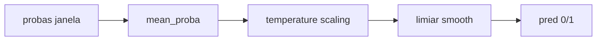

# Calibração automática (`src/training`)

A métrica oficial é **Macro-F1 a nível de vídeo**, mas os modelos produzem um
**score contínuo** por vídeo. O pipeline sklearn (CatBoost / RF) usa **três etapas**
na validação:



1. **Agrega janela → vídeo** (`video_scores`): CatBoost/RF gera 1 proba por janela;
   agregamos num score por vídeo (`method`, default `mean_proba`).
2. **Temperature scaling** (`score_calibration.py`): ajusta `T` minimizando **NLL**
   (cross-entropy) nos scores de vídeo da val → `sigmoid(logit(s)/T)`.
3. **Limiar smooth** (`calibrate_threshold_from_video_scores`): varre limiares no
   score calibrado e escolhe o centro do platô estável (robusto a val pequena).

> Tudo calibrado **só na val**, nunca no test.

## Por que `smooth` no limiar (branch isa)

| `calibration` | limiar (val) | F1 val | **F1 test** |
|---|---|---|---|
| `argmax` | 0.30 (spike) | 0.719 | 0.614 |
| `smooth` | 0.63 (platô) | 0.707 | **0.701** |

Referência da branch [`isa`](https://github.com/Liga-de-IA-PUCPR/abaw-11-ah-challenge/tree/isa/src/training).

## Configuração (`configs/aggregation/default.yaml`)

| campo | valores | o que faz |
|---|---|---|
| `method` | `mean_proba`·`max_proba`·… | agregação janela→vídeo |
| `score_calibration` | `none` · `temperature` | calibra scores antes do limiar |
| `threshold` | `auto` · `<float>` | `auto` calibra na val |
| `calibration` | `smooth` · `argmax` | estratégia do limiar (default `smooth`) |
| `smooth_window` | float (ex. `0.10`) | largura da média móvel do limiar |

## Experimentos CatBoost

```bash
uv sync

# treino + temperature + smooth
uv run python main.py +experiment=catboost_baseline mode=train \
  aggregation.score_calibration=temperature \
  aggregation.calibration=smooth \
  wandb.mode=disabled

# evaluate test + plots (confusão, ROC, PR, limiar)
uv run python main.py +experiment=catboost_baseline mode=evaluate split=test \
  wandb.mode=disabled
```

Pesos de classe: `auto_class_weights: Balanced` em [`configs/model/catboost.yaml`](../../configs/model/catboost.yaml).

## Onde está no código

| arquivo | papel |
|---|---|
| [`score_calibration.py`](score_calibration.py) | `fit_temperature`, `apply_temperature` |
| [`aggregation.py`](aggregation.py) | `calibrate_threshold`, `calibrate_threshold_from_video_scores` |
| [`sklearn_trainer.py`](sklearn_trainer.py) | pipeline fit: agregação → temperature → limiar |
| [`../outputs/reporter.py`](../outputs/reporter.py) | plots: confusão, ROC, PR, limiar |
